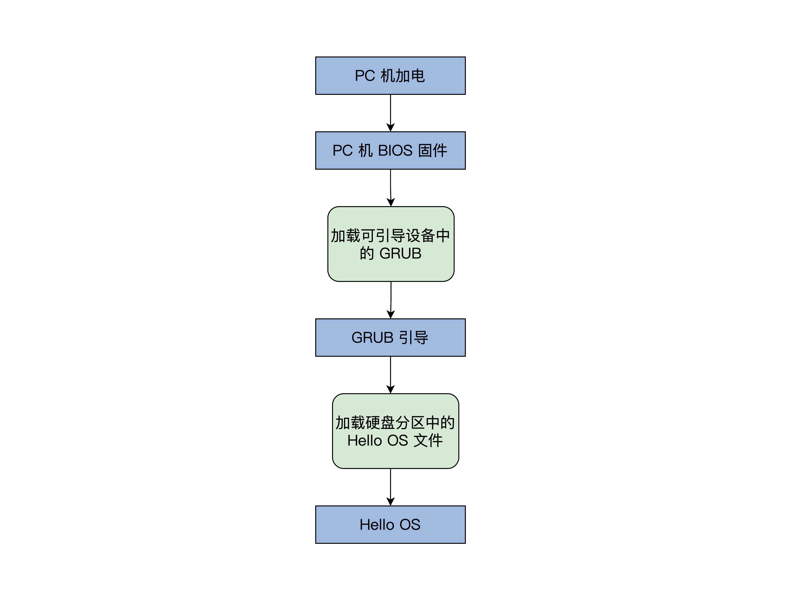

## 利用汇编和C，实现一个最简单的内核（下马威！）

### PC 机的引导流程

PC 机 BIOS 固件是固化在 PC 机主板上的 ROM 芯片中的，掉电也能保存，PC 机上电后的第一条指令就是 BIOS 固件中的，它负责检测和初始化 CPU、内存及主板平台，然后加载引导设备（大概率是硬盘）中的第一个扇区数据，到 0x7c00 地址开始的内存空间，再接着跳转到 0x7c00 处执行指令，在我们这里的情况下就是 GRUB 引导程序。

### Hello OS 引导汇编代码

### Hello OS 主函数

### 控制计算机屏幕（显卡）

### 编译和安装

### 安装 Hello OS

## 思考题（ question ）

以上 printf 函数定义，其中有个形式参数很奇怪，请你思考下：为什么是“…”形式参数，这个形式参数有什么作用？

https://kbs.sports.qq.com/kbsweb/game.htm?mid=100000:55367068