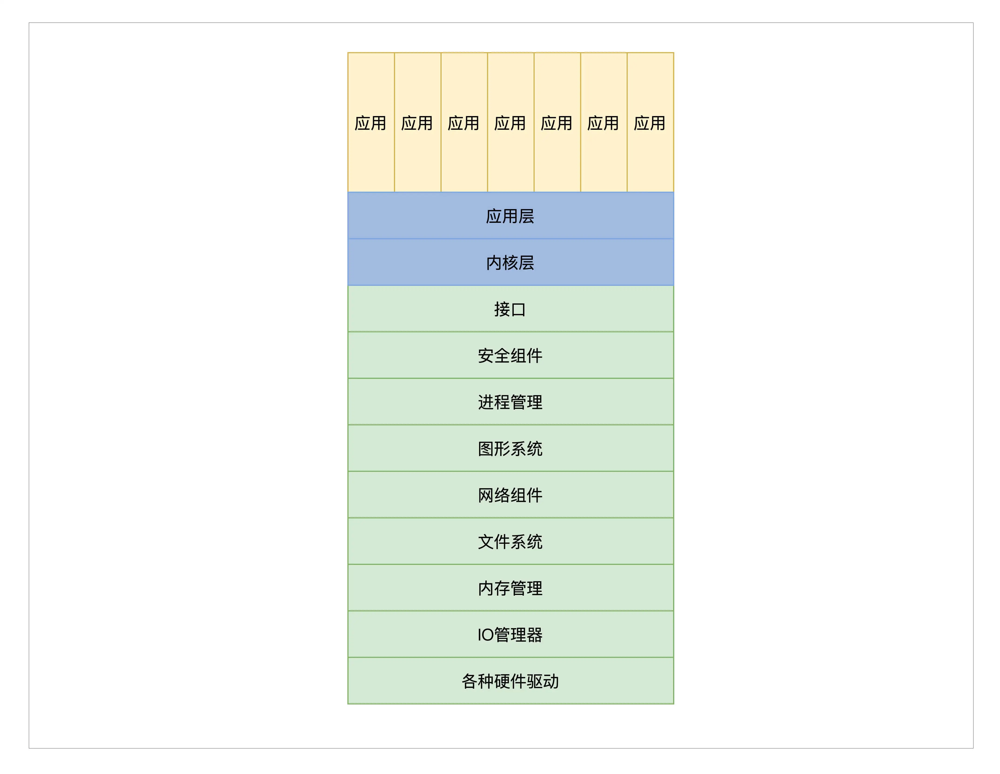
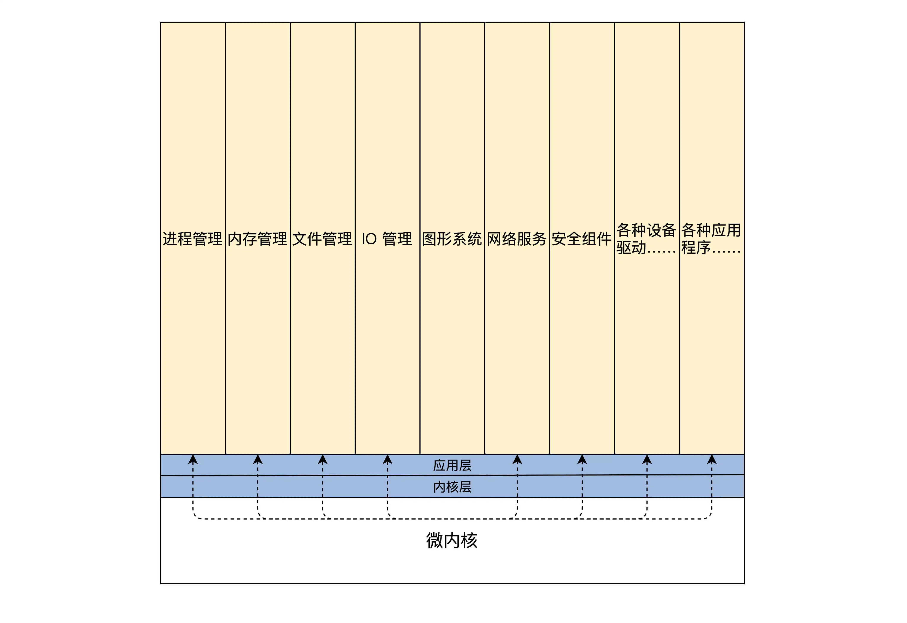
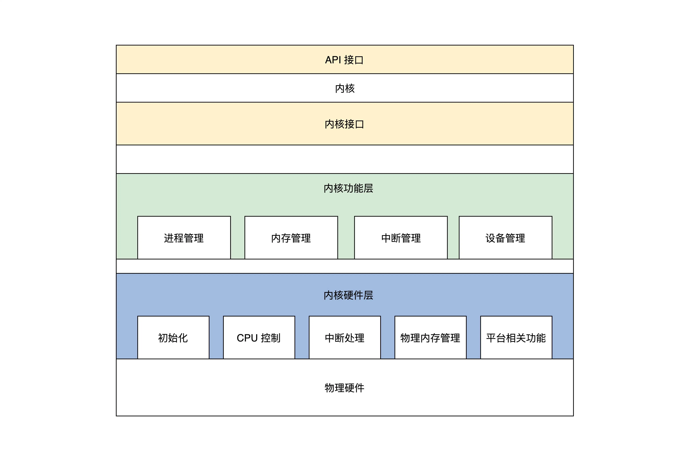

## 内核：内核结构与设计

从抽象角度来看，内核就是计算机资源的管理者，当然管理资源是为了让应用使用资源。

### 详解内核

内核作为硬件资源和软件资源的管理者，其内部组成在逻辑上大致如下：

    1.管理 CPU，由于 CPU 是执行程序的，而内核把运行时的程序抽象成进程，所以又称为进程管理。
    2.管理内存，由于程序和数据都要占用内存，内存是非常宝贵的资源，所以内核要非常小心地分配、释放内存。
    3.管理硬盘，而硬盘主要存放用户数据，而内核把用户数据抽象成文件，即管理文件，文件需要合理地组织，方便用户查找和读写，所以形成了文件系统。
    4.管理显卡，负责显示信息，而现在操作系统都是支持 GUI（图形用户接口）的，管理显卡自然而然地就成了内核中的图形系统。
    5.管理网卡，网卡主要完成网络通信，网络通信需要各种通信协议，最后在内核中就形成了网络协议栈，又称网络组件。
    6.管理各种 I/O 设备，我们经常把键盘、鼠标、打印机、显示器等统称为 I/O（输入输出）设备，在内核中抽象成 I/O 管理器。

### 宏内核结构

宏内核就是把以上诸如管理进程的代码、管理内存的代码、管理各种 I/O 设备的代码、文件系统的代码、图形系统代码以及其它功能模块的代码，把这些所有的代码经过编译，最后链接在一起，形成一个大的可执行程序。

宏内核提供内存分配功能的服务过程，具体如下：

    1. 应用程序调用内存分配的 API（应用程序接口）函数。
    2. 处理器切换到特权模式，开始运行内核代码。
    3. 内核里的内存管理代码按照特定的算法，分配一块内存。
    4. 把分配的内存块的首地址，返回给内存分配的 API 函数。
    5. 内存分配的 API 函数返回，处理器开始运行用户模式下的应用程序，应用程序就得到了一块内存的首地址，并且可以使用这块内存了。

### 微内核结构

微内核架构正好与宏内核架构相反，它提倡内核功能尽可能少：仅仅只有进程调度、处理中断、内存空间映射、进程间通信等功能。

这样的内核是不能完成什么实际功能的，开发者们把实际的进程管理、内存管理、设备管理、文件管理等服务功能，做成一个个服务进程。和用户应用进程一样，只是它们很特殊，宏内核提供的功能，在微内核架构里由这些服务进程专门负责完成。

微内核定义了一种良好的进程间通信的机制——消息。应用程序要请求相关服务，就向微内核发送一条与此服务对应的消息，微内核再把这条消息转发给相关的服务进程，接着服务进程会完成相关的服务。服务进程的编程模型就是循环处理来自其它进程的消息，完成相关的服务功能。

微内核提供内存分配功能的服务过程，具体如下：

    1. 应用程序发送内存分配的消息，这个发送消息的函数是微内核提供的，相当于系统 API，微内核的 API（应用程序接口）相当少，极端情况下仅需要两个，一个接收消息的 API 和一个发送消息的 API。
    2. 处理器切换到特权模式，开始运行内核代码。
    3. 微内核代码让当前进程停止运行，并根据消息包中的数据，确定消息发送给谁，分配内存的消息当然是发送给内存管理服务进程。
    4. 内存管理服务进程收到消息，分配一块内存。
    5. 内存管理服务进程，也会通过消息的形式返回分配内存块的地址给内核，然后继续等待下一条消息。
    6. 微内核把包含内存块地址的消息返回给发送内存分配消息的应用程序。
    7. 处理器开始运行用户模式下的应用程序，应用程序就得到了一块内存的首地址，并且可以使用这块内存了。

### 分离硬件的相关性

今天如此庞杂的计算机，其实也是一层一层地构建起来的，从硬件层到操作系统层再到应用软件层这样构建。分层的主要目的和好处在于屏蔽底层细节，使上层开发更加简单。

计算机领域的一个基本方法是增加一个抽象层，从而使得抽象层的上下两层独立地发展，所以在内核内部再分若干层也不足为怪。

分离硬件的相关性，就是要把操作硬件和处理硬件功能差异的代码抽离出来，形成一个独立的软件抽象层，对外提供相应的接口，方便上层开发。

一个例子：进程调度模块

进程是操作系统开发者为了实现多任务而提出的，并让每个进程在 CPU 上运行一小段时间，这样就能实现多任务同时运行的假象。要实现这种假象，就要实现下面这两种机制：

    1.进程调度，它的目的是要从众多进程中选择一个将要运行的进程，当然有各种选择的算法，例如，轮转算法、优先级算法等。
    2.进程切换，它的目的是停止当前进程，运行新的进程，主要动作是保存当前进程的机器上下文，装载新进程的机器上下文。

## 要做的操作系统内核分为三个大层

    1. 内核接口层。
    2. 内核功能层。
    3. 内核硬件层。

### 内核接口层

定义了一系列接口，主要有两点内容，如下：

    1. 定义了一套 UNIX 接口的子集，我们出于学习和研究的目的，使用 UNIX 接口的子集，优点之一是接口少，只有几个，并且这几个接口又能大致定义出操作系统的功能。
    2. 这套接口的代码，就是检查其参数是否合法，如果参数有问题就返回相关的错误，接着调用下层完成功能的核心代码。

### 内核功能层

主要完成各种实际功能，这些功能按照其类别可以分成各种模块，当然这些功能模块最终会用具体的算法、数据结构、代码去实现它，内核功能层的模块如下：

    1. 进程管理，主要是实现进程的创建、销毁、调度进程，当然这要设计几套数据结构用于表示进程和组织进程，还要实现一个简单的进程调度算法。
    2. 内存管理，在内核功能层中只有内存池管理，分两种内存池：页面内存池和任意大小的内存池，你现在可能不明白什么是内存池，这里先有个印象就行，后面课程研究它的时候再详细介绍。
    3. 中断管理，这个在内核功能层中非常简单：就是把一个中断回调函数安插到相关的数据结构中，一旦发生相关的中断就会调用这个函数。
    4. 设备管理，这个是最难的，需要用一系列的数据结构表示驱动程序模块、驱动程序本身、驱动程序创建的设备，最后把它们组织在一起，还要实现创建设备、销毁设备、访问设备的代码，这些代码最终会调用设备驱动程序，达到操作设备的目的。

### 内核硬件层

主要包括一个具体硬件平台相关的代码，如下：

    1. 初始化，初始化代码是内核被加载到内存中最先需要运行的代码，例如初始化少量的设备、CPU、内存、中断的控制、内核用于管理的数据结构等。
    2. CPU 控制，提供 CPU 模式设定、开、关中断、读写 CPU 特定寄存器等功能的代码。
    3. 中断处理，保存中断时机器的上下文，调用中断回调函数，操作中断控制器等。
    4. 物理内存管理，提供分配、释放大块内存，内存空间映射，操作 MMU、Cache 等。
    5. 平台其它相关的功能，有些硬件平台上有些特殊的功能，需要额外处理一下。

## 思考题

其实我们的内核架构不是我们首创的，它是属于微内核、宏内核之外的第三种架构，请问这是什么架构？

内核设计的演进貌似和软件系统架构演进惊人的相似。宏内核和单体架构一致，微内核和SOA架构一致，而课程里面讲的第三种架构更像是微服务架构。从整体的架构演进来看，核心就是拆分，从all in one到垂直拆分，再到水平拆分，更面向用户操作和技术专注。