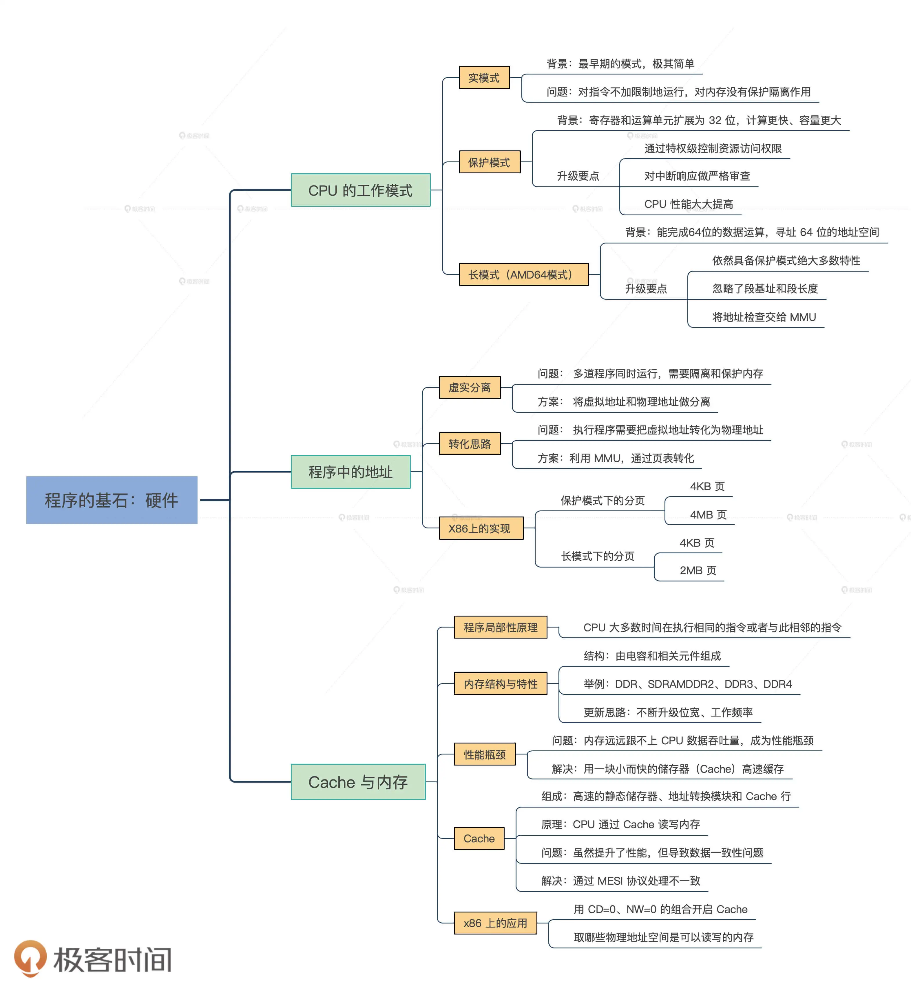

## Cache与内存：程序放在哪儿？

### 程序【局部性原理】

### 内存（DRAM动态随机存储器）

### Cache，解决CPU到内存的性能瓶颈

### 缓存数据一致性问题

### Cache 的 MESI 协议（ question ）

MESI 协议定义了 4 种基本状态：M、E、S、I，即修改（Modified）、独占（Exclusive）、共享（Shared）和无效（Invalid）。

### 开启Cache

### 获取内存视图（这是个什么意思）

### 硬件

### 思考题

如何写出让 CPU 跑得更快的代码？由于 Cache 比内存快几个数量级，所以这个问题也可以转换成：如何写出提高 Cache 命中率的代码？
