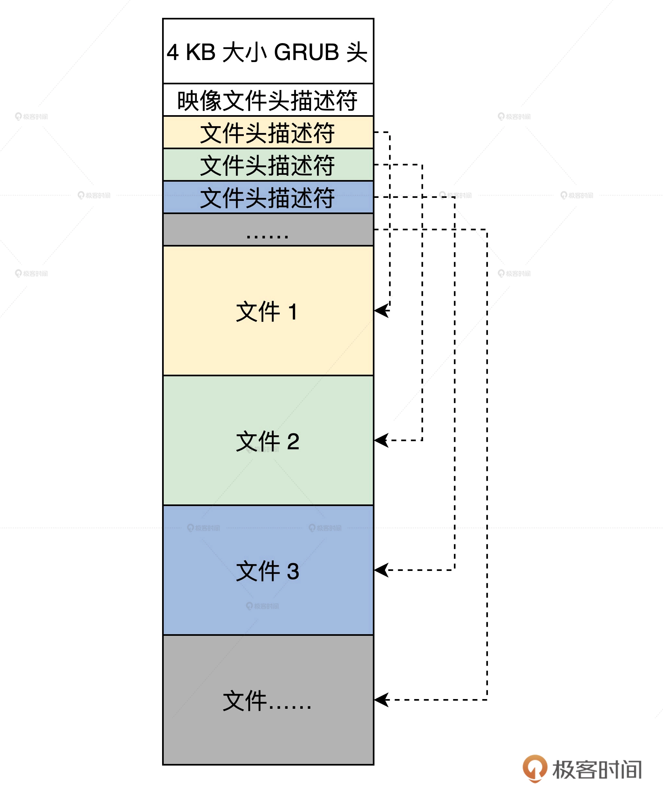

## 设置工作模式与环境（上）：建立计算机

### 从内核映像格式说起

### 准备虚拟机 & 安装虚拟机（VirtualBox）

### 建立虚拟电脑
### 手工生产硬盘

### 生产虚拟硬盘

其实虚拟机只是用特定格式的文件来模拟硬盘，所以生产虚拟硬盘就变成了生成对应格式的文件

### 格式化虚拟硬盘

虚拟硬盘也需要格式化才能使用，所谓格式化就是在硬盘上建立文件系统。只有建立了文件系统，现有的成熟操作系统才能在其中存放数据。可是，问题来了。虚拟硬盘毕竟是个文件，如何让 Linux 在一个文件上建立文件系统呢？这个问题我们要分成三步来解决。

### 安装GRUB

正常安装系统的情况下，Linux 会把 GRUB 安装在我们的物理硬盘上，可是我们现在要把 GRUB 安装在我们的虚拟硬盘上，而且我们的操作系统还没有安装程序。所以，我们得利用一下手上 Linux（HOST OS），通过 GRUB 的安装程序，把 GRUB 安装到指定的设备上（虚拟硬盘）。

> PS：set root='hd0,msdos1' 这一步有坑，这一步如果修改了需要重新执行之后的操作（暂时这么理解）

### 转换虚拟硬盘格式

你可能会好奇，我们前面好不容易生产了 mount 命令能识别的虚拟硬盘，这里为什么又要转换虚拟硬盘的格式呢？

这是因为这个纯二进制格式只能被我们使用的 Linux 系统识别，但不能被虚拟机本身识别，但是我们最终目的却是让这个虚拟机加载这个虚拟硬盘，从而启动其中的由我们开发的操作系统。

### 安装虚拟硬盘

虚拟硬盘必须要安装虚拟机才可以运行，也就是这个 hd.vdi 文件要和虚拟机软件联系起来。

### 启动

### 思考题

请问，我们为什么要把虚拟硬盘格式化成 ext4 文件系统格式呢？

### question 

1. 内核映像文件
2. grub.cfg文本文件中的“set root”值从何而来