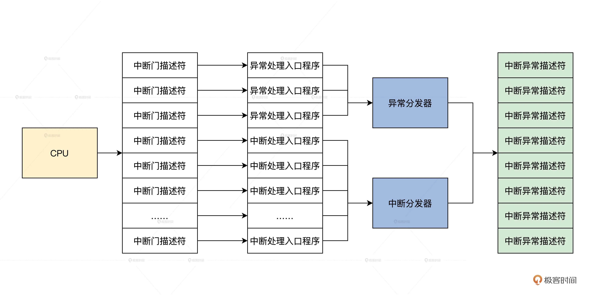
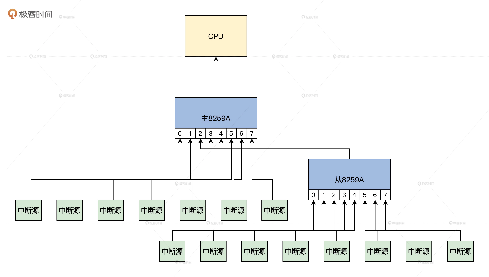

## 第一个C函数：如何实现板级初始化？

这节课我们要让操作系统 Cosmos 里的第一个 C 函数真正跑起来啦，也就是说，我们会真正进入到我们的内核中。

今天我们会继续在这个 hal_start 函数里，首先执行板级初始化，其实就是 hal 层（硬件抽象层，下同）初始化，其中执行了【平台初始化】，hal 层的【内存初始化】，【中断初始化】，最后进入到内核层的初始化。

### 第一个 C 函数

### hal层初始化


为了分离硬件的特性，我们设计了 hal 层，把硬件相关的操作集中在这个层，并向上提供接口，目的是让内核上层不用关注硬件相关的细节，也能方便以后移植和扩展。

主要是完成**初始化平台、初始化内存、初始化中断**的功能函数。

### 初始化平台

这个函数主要负责完成两个任务：

1. 把二级引导器建立的机器信息结构复制到 hal 层中的一个全局变量中，方便内核中的其它代码使用里面的信息，之后二级引导器建立的数据所占用的内存都会被释放。

2. 要初始化图形显示驱动，内核在运行过程要在屏幕上输出信息。

### 内存初始化

hal 层的内存初始化比较容易，只要向内存管理器提供【内存空间布局信息】就可以。

根据 e820map_t 结构数组，建立了一个 phymmarge_t 结构数组，init_one_pmrge 函数正是把 e820map_t 结构中的信息复制到 phymmarge_t 结构中来。

### 初始化中断

【中断表】： gate_t 结构的数组

中断入口处理程序只负责这三件事(nernel.inc)：

1. 保护 CPU 寄存器，即中断发生时的程序运行的上下文。
2. 调用中断处理程序，这个程序可以是修复异常的，可以是设备驱动程序中对设备响应的程序。
3. 恢复 CPU 寄存器，即恢复中断时程序运行的上下文，使程序继续运行。

### 中断处理框架



如果内核或者设备驱动程序要安装一个中断处理函数，就要先申请一个 intserdsc_t 结构体，然后把中断函数的地址写入其中，最后把这个结构挂载到对应的 intfltdsc_t 结构中的 i_serlist 链表中。

**为什么不能直接把中断处理函数放在 intfltdsc_t 结构中呢，还要多此一举搞个 intserdsc_t 结构体呢？**

这是因为我们的计算机中可能有很多设备，每个设备都可能产生中断，但是中断控制器的中断信号线是有限的。你可以这样理解：中断控制器最多只能产生几十号中断号，而设备不止几十个，所以会有多个设备共享一根中断信号线。这就导致一个中断发生后，无法确定是哪个设备产生的中断，所以我们干脆让设备驱动程序来决定，因为它是最了解设备的。这里我们让这个 intfltdsc_t 结构上的所有中断处理函数都依次执行，查看是不是自己的设备产生了中断，如果是就处理，不是则略过。

### 初始化中断控制器

我们把 CPU 端的中断搞定了以后，还有设备端的中断，这个可以交给设备驱动程序，但是 CPU 和设备之间的中断控制器，还需要我们出面解决。

多个设备的中断信号线都会连接到中断控制器上，中断控制器可以决定启用或者屏蔽哪些设备的中断，还可以决定设备中断之间的优先线，所以它才叫中断控制器。



### 进入内核

```c
void hal_start()
{   
    //初始化hal层 
    init_hal();
    //初始化内核层    
    init_krl();    
    return;
}
```

### 总结

1. Cosmos 的第一个 C 函数产生了，它十分简单但极其有意义，它的出现标志着 C 语言的运行环境已经完善。从此我们可以用 C 语言高效地开发操作系统了，由爬行时代进入了跑步前行的状态，可喜可贺。
2. 第一个 C 函数，干的第一件重要工作就是调用 hal 层的初始化函数。这个初始化函数首先初始化了平台，初始化了机器信息结构供内核的其它代码使用，还初始化了我们图形显示驱动、显示了背景图片；其次是初始化了内存管理相关的数据结构；接着初始了中断，中断处理框架是两层，所以最为复杂；最后初始化了中断控制器。
3. 当 hal 层初始化完成了，我们就进入了内核层，由于到了课程的尾声，我们先暂停在这里。

### 思考题

### question

1. 平台初始化。（1）halplatform.c,把二级引导器建立的机器信息结构复制到 hal 层中的一个全局变量中；（2）bdvideo.c，初始化图形显示驱动；
2. 内存初始化，halmm.c（根据一个e820map_t结构建立一个phymmarge_t结构）
3. phymmarge_t， kmachbsp（没懂）
3. 初始化中断，halsgdidt.c，halintupt.c。
5. 区分中断（异步，例如：按键）和异常（同步，例如：缺页）
4. kernel.inc，kernel.asm（中断入口处理程序）
5. 中断框架，init_intfltdsc
6. 中断异常描述符 intfltdsc_t, intserdsc_t 
7. 中断控制器 8259.c
