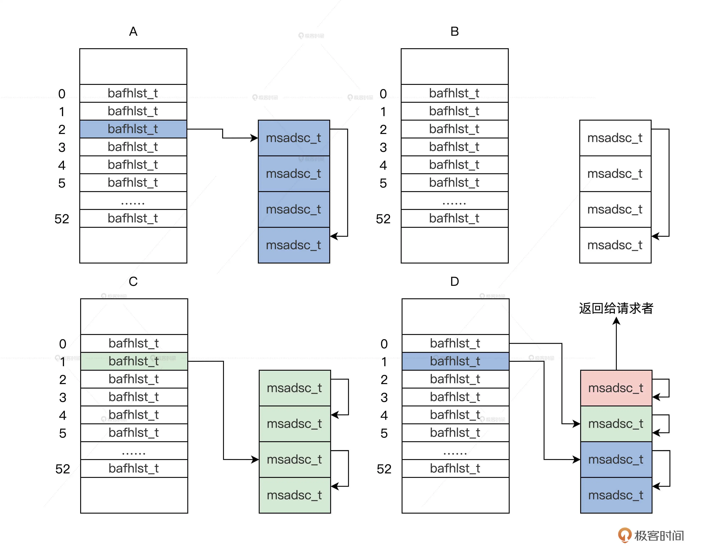
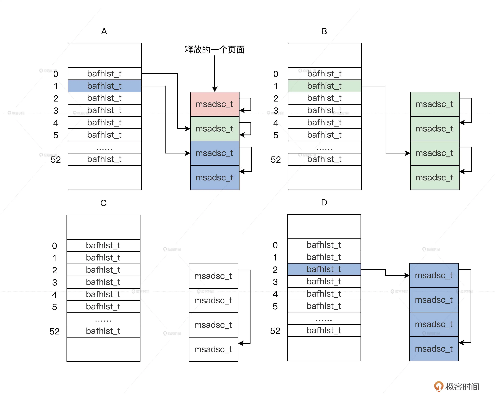

## 划分土地（下）：如何实现内存页的分配与释放？

### 内存页的分配

内存管理器要为内核、驱动，还有应用提供服务，它们对请求内存页面的多少、内存页面是不是连续，内存页面所处的物理地址都有要求。

内存管理代码的结构是：接口函数调用框架函数，框架函数调用核心函数。

要分配一个页面，这个算法将执行如下步骤：

1. 根据一个页面的请求，会返回 m_mdmlielst 数组中的第 0 个 bafhlst_t 结构。
2. 如果第 0 个 bafhlst_t 结构中有 msadsc_t 结构就直接返回，若没有 msadsc_t 结构，就会继续查找 m_mdmlielst 数组中的第 1 个 bafhlst_t 结构。
3. 如果第 1 个 bafhlst_t 结构中也没有 msadsc_t 结构，就会继续查找 m_mdmlielst 数组中的第 2 个 bafhlst_t 结构。
4. 如果第 2 个 bafhlst_t 结构中有 msadsc_t 结构，记住第 2 个 bafhlst_t 结构中对应是 4 个连续的 msadsc_t 结构。这时让这 4 个连续的 msadsc_t 结构从第 2 个 bafhlst_t 结构中脱离。
5. 把这 4 个连续的 msadsc_t 结构，对半分割成 2 个双 msadsc_t 结构，把其中一个双 msadsc_t 结构挂载到第 1 个 bafhlst_t 结构中。
6. 把剩下一个双 msadsc_t 结构，继续对半分割成两个单 msadsc_t 结构，把其中一个单 msadsc_t 结构挂载到第 0 个 bafhlst_t 结构中，剩下一个单 msadsc_t 结构返回给请求者，完成内存分配。

### 内存页的释放

**最核心的还是要对空闲页面进行合并，合并成更大的连续的内存页面**

要释放一个页面，这个算法将执行如下步骤:

1. 释放一个页面，会返回 m_mdmlielst 数组中的第 0 个 bafhlst_t 结构。
2. 设置这个页面对应的 msadsc_t 结构的相关信息，表示已经执行了释放操作。
3. 开始查看第 0 个 bafhlst_t 结构中有没有空闲的 msadsc_t，并且它和要释放的 msadsc_t 对应的物理地址是连续的。没有则把这个释放的 msadsc_t 挂载第 0 个 bafhlst_t 结构中，算法结束，否则进入下一步。
4. 把第 0 个 bafhlst_t 结构中的 msadsc_t 结构拿出来与释放的 msadsc_t 结构，合并成 2 个连续且更大的 msadsc_t。
5. 继续查看第 1 个 bafhlst_t 结构中有没有空闲的 msadsc_t，而且这个空闲 msadsc_t 要和上一步合并的 2 个 msadsc_t 对应的物理地址是连续的。没有则把这个合并的 2 个 msadsc_t 挂载第 1 个 bafhlst_t 结构中，算法结束，否则进入下一步。
6. 把第 1 个 bafhlst_t 结构中的 2 个连续的 msadsc_t 结构，还有合并的 2 个地址连续的 msadsc_t 结构拿出来，合并成 4 个连续且更大的 msadsc_t 结构。
7. 继续查看第 2 个 bafhlst_t 结构，有没有空闲的 msadsc_t 结构，并且它要和上一步合并的 4 个 msadsc_t 结构对应的物理地址是连续的。没有则把这个合并的 4 个 msadsc_t 挂载第 2 个 bafhlst_t 结构中，算法结束。

### 总结

1. 我们实现了内存分配**接口、框架、核心处理函数**，其分配算法是： 如果能在 dm_mdmlielst 数组中找到对应请求页面数的 msadsc_t 结构就直接返回，如果没有就寻找下一个 dm_mdmlielst 数组中元素，依次迭代直到最大的 dm_mdmlielst 数组元素，然后依次对半分割，直到分割到请求的页面数为止。

2. 对应于内存分配过程，我们实现了释放页面的**接口、框架、核心处理函数**，其释放算法则是分配算法的逆向过程： 会查找相邻且物理地址连续的 msadsc_t 结构，进行合并，合并工作也是迭代过程，直到合并到最大的连续 msadsc_t 结构或者后面不能合并为止，最后把这个合并到最大的连续 msadsc_t 结构，挂载到对应的 dm_mdmlielst 数组中。

### 思考题

在内存页面分配过程中，是怎样尽可能保证内存页面连续的呢？

### question

1. 内存页分配细节
2. 内存页释放细节
3. 这一节明白算法就好