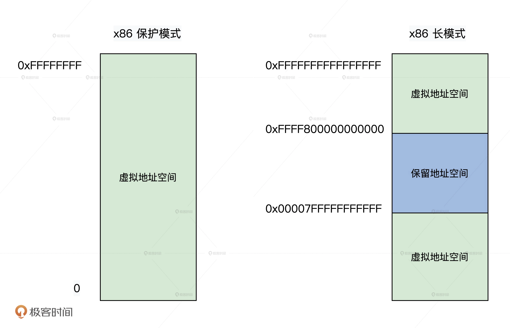
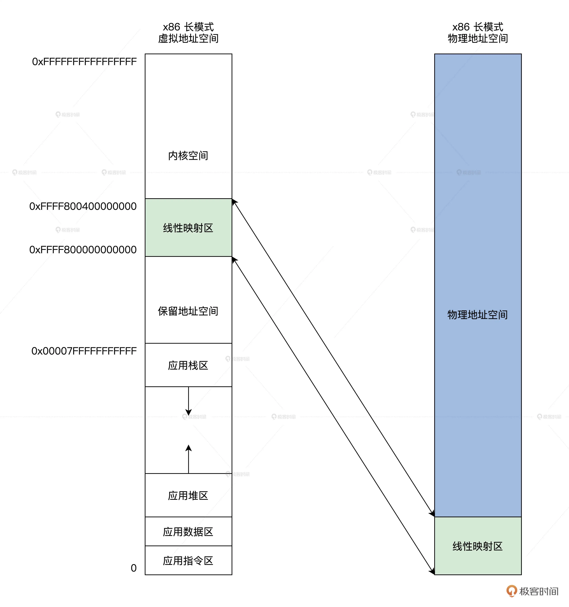
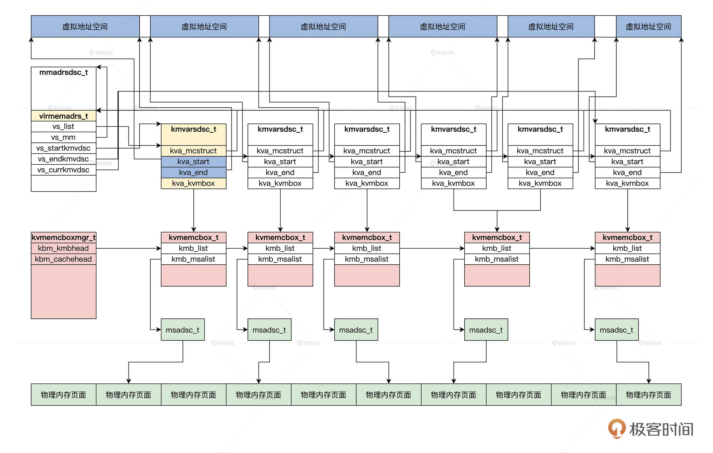
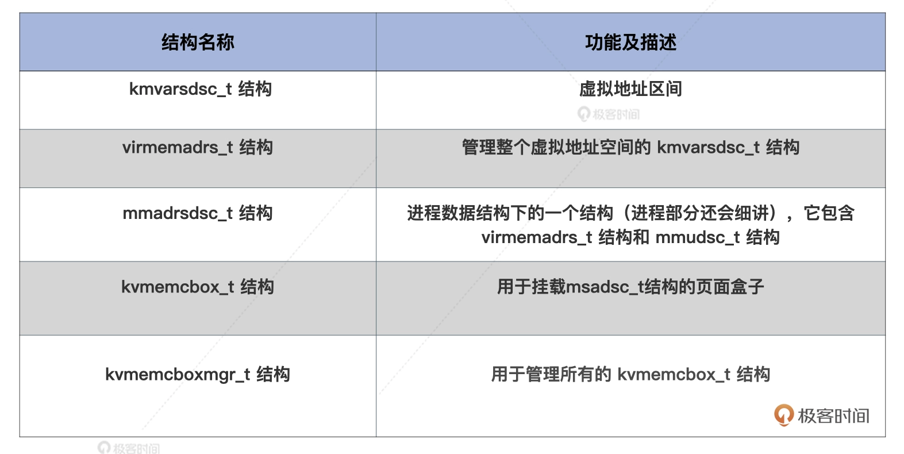

## 如何表示虚拟内存？

一个应用往往拥有很大的连续地址空间，并且每个应用都是一样的，只有在运行时才能分配到真正的物理内存，在操作系统中这称为【虚拟内存】。

### 虚拟地址空间的划分

虚拟地址就是逻辑上的一个数值，而虚拟地址空间就是一堆数值的集合。

###　x86 CPU 如何划分虚拟地址空间

由于 x86 CPU 支持虚拟地址空间时，要么开启保护模式，要么开启长模式，保护模式下是 32 位的，有 0～0xFFFFFFFF 个地址，可以使用完整的 4GB 虚拟地址空间。

在保护模式下，对这 4GB 的虚拟地址空间没有进行任何划分，而长模式下是 64 位的虚拟地址空间有 0～0xFFFFFFFFFFFFFFFF 个地址，这个地址空间非常巨大，硬件工程师根据需求设计，把它分成了 3 段

长模式下，CPU 目前只实现了 48 位地址空间，但寄存器却是 64 位的，CPU 自己用地址数据的第 47 位的值扩展到最高 16 位，所以 64 位地址数据的最高 16 位，要么是全 0，要么全 1

### Cosmos 如何划分虚拟地址空间

### 如何设计数据结构

这里涉及到虚拟地址区间，管理虚拟地址区间以及它所对应的物理页面，最后让进程和虚拟地址空间相结合。

### 虚拟地址区间

由于虚拟地址空间非常巨大，我们绝不能像管理物理内存页面那样，一个页面对应一个结构体。

虚拟地址空间往往是以区为单位的，比如栈区、堆区，指令区、数据区，这些区内部往往是连续的，区与区之间却间隔了很大空间，而且每个区的空间扩大时我们不会建立新的虚拟地址区间数据结构，而是改变其中的指针，这就节约了内存空间。

### 整个虚拟地址空间如何描述

整个的虚拟地址空间，正是由多个虚拟地址区间连接起来组成，也就是说，只要把许多个虚拟地址区间数据结构按顺序连接起来，就可以表示整个虚拟地址空间了。

### 进程的内存地址空间

虚拟地址空间作用于应用程序，而应用程序在操作系统中用进程表示。当然，一个进程有了虚拟地址空间信息还不够，还要知道进程和虚拟地址到物理地址的映射信息，应用程序文件中的指令区、数据区的开始、结束地址信息。

### 页面盒子

我们知道每段虚拟地址区间，在用到的时候都会映射对应的物理页面。根据前面我们物理内存管理器的设计，每分配一个或者一组内存页面，都会返回一个 msadsc_t 结构，所以我们还需要一个数据结构来挂载 msadsc_t 结构。

但为什么不直接挂载到 kmvarsdsc_t 结构中去，而是要设计一个新的数据结构呢？

### 页面盒子头

kvmemcbox_t 结构是一个独立的存在，我们必须能找到它，所以还需要设计一个全局的数据结构，用于管理所有的 kvmemcbox_t 结构。这个结构用于挂载 kvmemcbox_t 结构，对其进行计数，还要支持缓存多个空闲的 kvmemcbox_t 结构

### 理清数据结构之间的关系（ 复杂 ）

首先从进程的虚拟地址空间开始，而进程的虚拟地址是由 kmvarsdsc_t 结构表示的，一个 kmvarsdsc_t 结构就表示一个已经分配出去的虚拟地址空间。一个进程所有的 kmvarsdsc_t 结构，要交给进程的 mmadrsdsc_t 结构中的 virmemadrs_t 结构管理。

为了管理虚拟地址空间对应的物理内存页面，我们建立了 kvmembox_t 结构，它由 kvmemcboxmgr_t 结构统一管理。在 kvmembox_t 结构中，挂载了物理内存页面对应的 msadsc_t 结构。

### 初始化

### 总结

首先是虚拟地址空间的划分。由于硬件平台的物理特性，虚拟地址空间被分成了两段，Cosmos 也延续了这种划分的形式，顶端的虚拟地址空间为内核占用，底端为应用占用。内核还建立了 16GB 的线性映射区，而应用的虚拟地址空间分成了指令区，数据区，堆区，栈区。

然后为了实现虚拟地址内存，我们设计了大量的数据结构，它们分别是虚拟地址区间 kmvarsdsc_t 结构、管理虚拟地址区间的虚拟地址空间 virmemadrs_t 结构、包含 virmemadrs_t 结构和 mmudsc_t 结构的 mmadrsdsc_t 结构、用于挂载 msadsc_t 结构的页面盒子的 kvmemcbox_t 结构、还有用于管理所有的 kvmemcbox_t 结构的 kvmemcboxmgr_t 结构。

### 思考题

请问内核虚拟地址空间为什么有一个 0xFFFF800000000000～0xFFFF800400000000 的线性映射区呢？

### question

1. 长模式虚拟地址划分
2. 划分虚拟地址空间和MMU页表映射有什么卵子关系
3. kmvarsdsc_t虚拟地址区间数据结构
4. kmvarsdsc_t中的自旋锁什么作用
5. virmemadrs_t
6. mmadrsdsc_t
7. kvmemcbox_t页面盒子是个什么鬼
8. kvmemcboxmgr_t