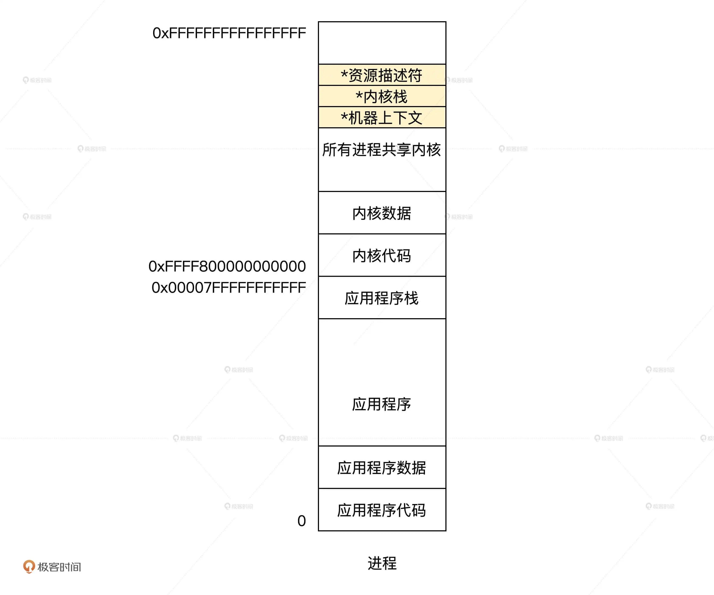

## 什么是进程

### 什么是进程

你运行一个应用程序时，操作系统也要记录这个应用程序使用多少内存，打开了什么文件，当有些资源不可用的时候要不要睡眠，当前进程运行到哪里了。操作系统把这些信息综合统计，存放在内存中，抽象为进程。

现在你就可以回答什么是进程了：进程是一个应用程序运行时刻的实例（从进程的结构看）；进程是应用程序运行时所需资源的容器（从进程的功能看）；甚至进程是一堆数据结构（从操作系统对进程实现的角度来说）。

进程必须要有一个地址空间，这个地址空间至少包括两部分内容：一部分是内核，一部分是用户的应用程序。

我们来细化一下进程需要实现哪些功能？

我们先从应用程序和内核的关系看。应用程序需要内核提供资源，而内核需要控制应用程序的运行。那么内核必须能够命令应用程序，让它随时中断（进入内核地址空间）或恢复执行，这就需要保存应用程序的机器上下文和它运行时刻的栈。


接着，我们深入内核提供服务的机制。众所周知，内核是这样提供服务的：通过停止应用程序代码运行，进入内核地址空间运行内核代码，然后返回结果。就像活动组织者会用表格备案一样，内核还需要记录一个应用程序都访问了哪些资源，比如打开了某个文件，或是访问了某个设备。而这样的“记录表”，我们就用“资源描述符”来表示。




### 实现进程
### 如何表示一个进程
### 进程的地址空间
### 进程的上下文
### 建立进程
### 建立进程接口
### 建立内核进程

什么是内核进程

### 创建 thread_t 结构
### 初始化内核栈
### 建立普通进程
### 思考题

请问，各个进程是如何共享同一份内核代码和数据的？

### question

```sh

一、数据结构
thread_t表示一个线程，包括：
锁【并发】、链表
进程标志、进程状态、进程编号【内存地址】、CPU编号【当前全是0】、CPU时间片、进程权限【内核or用户】、优先级【越小越高】、运行模式
栈信息【内核栈、应用栈】，每个进程的栈是独立的，向下生长
内存地址空间信息virmemadrs_t，每个进程的内核部分是共用的，应用部分是独立的，通过页表实现
上下文信息，用于进程切换
进程打开资源的描述符，最多TD_HAND_MAX个

二、新建进程
init_krl->init_krlcpuidle->new_cpuidle->new_cpuidle_thread->krlnew_thread
->krlnew_kern_thread_core新建内核进程
->krlnew_user_thread_core新建用户进程

krlnew_kern_thread_core：
A、krlnew分配内核栈空间
B、krlnew_thread_dsc建立thread_t结构体的实例变量，并初始化
C、设置进程权限，优先级，进程的内核栈顶和内核栈开始地址
D、初始化进程的内核栈
E、加入进程调度系统，sschedcls.scls_schda[cpuid].sda_thdlst[td_priority].tdl_lsth

krlnew_user_thread_core：
A、krlnew分配应用程序栈空间
B、krlnew分配内核栈空间
C、krlnew_thread_dsc建立thread_t结构体的实例变量，并初始化
D、设置进程权限，优先级，进程的内核栈顶和内核栈开始地址，进程用户栈顶和内核栈开始地址
E、初始化进程的应用栈
F、加入进程调度系统，sschedcls.scls_schda[cpuid].sda_thdlst[td_priority].tdl_lsth

三、中断进程切换【以硬件中断为例】
A、定义了宏HARWINT，其中硬件中断分发器函数为hal_hwint_allocator
%macro HARWINT 1
    保存现场......
    mov rdi, %1
    mov rsi,rsp
    call hal_hwint_allocator
    恢复现场......
%endmacro

B、定义了各种硬件中断编号，比如hxi_hwint00，作为中断处理入口
ALIGN 16
hxi_hwint00:
    HARWINT (INT_VECTOR_IRQ0+0)

C、有硬件中断时
CPU 会根据中断门描述里的目标段选择子，进行必要的特权级切换；
特权级的切换就必须要切换栈，CPU 硬件会自己把当前 rsp 寄存器保存到内部的临时寄存器 tmprsp；
然后从 x64tss_t 结构体 【地址在GDT表，由 CPU 的 tr 寄存器指向】中找出对应的栈地址，装入 rsp 寄存器中；
接着，再把当前的 ss、tmprsp、rflags、cs、rip，依次压入当前 rsp 指向的栈中。

D、然后会先到达中断处理入口
保护现场
调用到硬件中断分发器函数hal_hwint_allocator
第一个参数为中断编号，在rdi
第二个参数为中断发生时的栈指针，在rsi
然后调用异常处理函数hal_do_hwint

E、hal_do_hwint
->调用中断回调函数hal_run_intflthandle
先获取中断异常表intfltdsc_t
然后调用intfltdsc_t.i_serlist 链表上，所有挂载intserdsc_t 结构中的，中断处理的回调函数，让函数自行判断是否处理中断
->中断处理完毕后调用krlsched_chkneed_pmptsched
->->一路返回，直到中断处理入口，还原现场，继续执行
->->或者调用krlschedul，继续进行调度，其实就可以返回用户态了

```