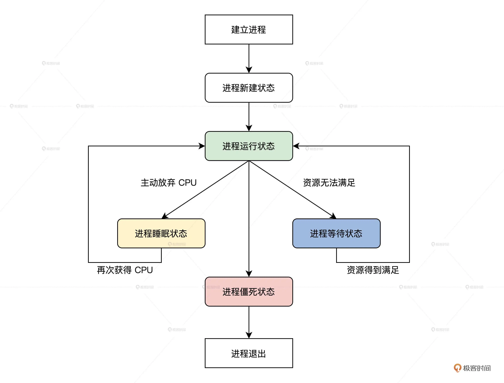
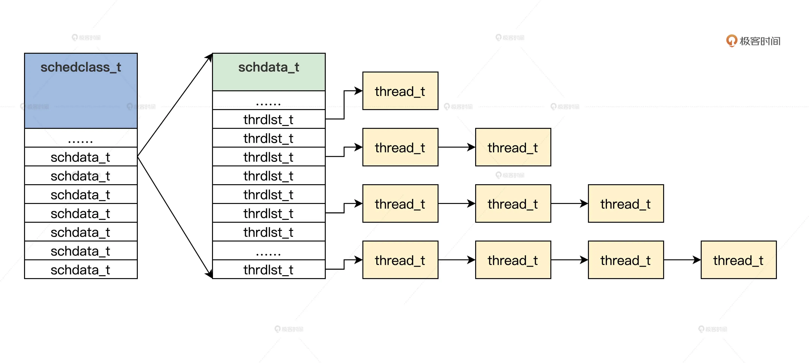

## 进程调度

### 为什么需要进程调度
### 管理进程
### 进程的生命周期

```c
#define TDSTUS_RUN 0        //进程运行状态
#define TDSTUS_SLEEP 3      //进程睡眠状态
#define TDSTUS_WAIT 4       //进程等待状态
#define TDSTUS_NEW 5        //进程新建状态
#define TDSTUS_ZOMB 6       //进程僵死状态
```



### 如何组织进程



### 管理进程的初始化

### 实现进程调度器
### 进程调度器入口

确定当前正在运行的进程，然后选择下一个将要运行的进程，最后从当前运行的进程，切换到下一个将要运行的进程。

### 如何获得当前运行的进程

获取当前正在运行的进程，目的是为了保存当前进程的运行上下文，确保在下一次调度到当前运行的进程时能够恢复运行。

### 选择下一个进程

首先，从高到低扫描优先级进程链表，然后若当前优先级进程链表不为空，就取出该链表上的第一个进程，放入 thrdlst_t 结构中的 tdl_curruntd 字段中，并把之前 thrdlst_t 结构的 tdl_curruntd 字段中的进程挂入该链表的尾部，并返回。最后，当扫描到最低优先级时也没有找到进程，就返回默认的空转进程。

### 获取空转进程

为什么要有一个空转进程，直接返回 NULL 不行吗？

### 进程切换

### 思考题

请问当调度器函数调度到一个新建进程时，为何要进入 retnfrom_first_sched 函数呢？

### question

1. schedclass_t,schdata_t,thrdlst_t 组织进程
2. 管理进程初始化
3. 空转进程（？？）
4. 进程切换（难懂）