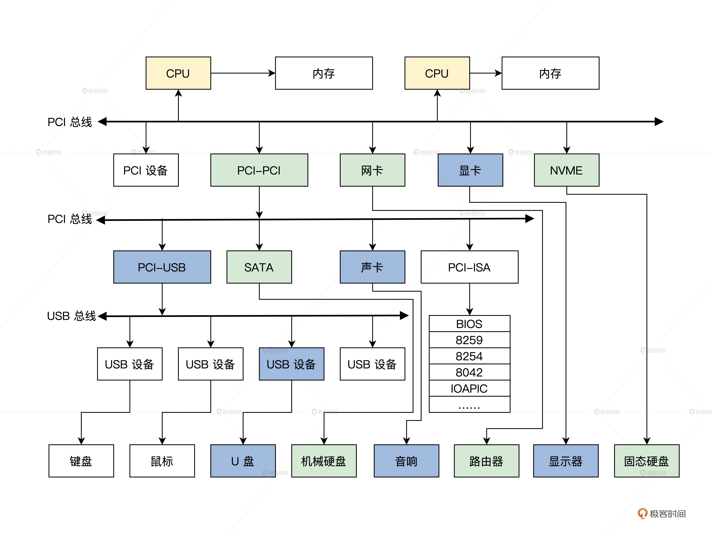
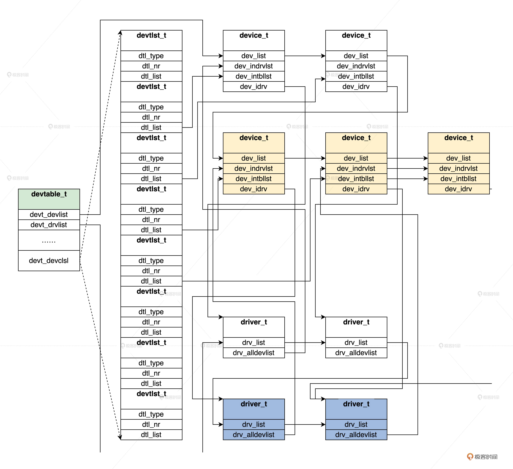

## 如何表示设备类型与设备驱动？

### 计算机的结构



### 如何管理设备

### 分权而治

1. 操作系统内核开发人员，不可能罗列世界上所有的设备，并为其写一套控制代码。
2. 为了商业目的，有很多设备厂商并不愿意公开设备的编程细节。就算内核开发人员想为其写控制代码，实际也不可行。
3. 如果设备更新换代，就要重写设备的控制代码，然后重新编译操作系统内核，这样的话操作很麻烦，操作系统内核开发人员和用户都可能受不了。

既然操作系统内核无法包含所有的设备控制代码，那就索性不包含，或者只包含最基本、最通用的设备控制代码。但是要控制设备就必须要有设备的相关控制代码才行，所以我们要把设备控制代码独立出来，与操作系统内核分开、独立开发，设备控制代码可由设备厂商人员开发。

### 设备分类

操作系统内核所感知的设备，一定要与物理设备一一对应吗？操作系统内核所感知的设备，并不需要和物理设备对应，这取决于设备控制代码自身的行为。


```c

#define NOT_DEVICE 0               //不表示任何设备
#define BRIDGE_DEVICE 4            //总线桥接器设备
#define CPUCORE_DEVICE 5           //CPU设备，CPU也是设备
#define RAMCONTER_DEVICE 6        //内存控制器设备
#define RAM_DEVICE 7              //内存设备
#define USBHOSTCONTER_DEVICE 8    //USB主控制设备
#define INTUPTCONTER_DEVICE 9     //中断控制器设备
#define DMA_DEVICE 10             //DMA设备
#define CLOCKPOWER_DEVICE 11      //时钟电源设备
#define LCDCONTER_DEVICE 12        //LCD控制器设备
#define NANDFLASH_DEVICE 13       //nandflash设备
#define CAMERA_DEVICE 14          //摄像头设备
#define UART_DEVICE 15             //串口设备
#define TIMER_DEVICE 16            //定时器设备
#define USB_DEVICE 17              //USB设备
#define WATCHDOG_DEVICE 18        //看门狗设备
#define RTC_DEVICE 22              //实时时钟设备
#define SD_DEVICE 25               //SD卡设备
#define AUDIO_DEVICE 26            //音频设备
#define TOUCH_DEVICE 27           //触控设备
#define NETWORK_DEVICE 28         //网络设备
#define VIR_DEVICE 29               //虚拟设备
#define FILESYS_DEVICE 30            //文件系统设备
#define SYSTICK_DEVICE 31           //系统TICK设备
#define UNKNOWN_DEVICE 32        //未知设备，也是设备
#define HD_DEVICE 33        //硬盘设备
```

### 设备驱动

这种“分权而治”的方式，给操作系统内核带了灵活性、可扩展性……可是也带来了新的问题，有哪些问题呢？

1. 首先是操作系统内核如何表示多个设备与驱动的存在？
2. 然后，还有如何组织多个设备和多个驱动程序的问题？
3. 最后我们还得考虑应该让驱动程序提供一些什么支持？

### 设备

操作系统内核和应用程序都不会主动建立设备，那么谁来建立设备呢？当然是控制设备的代码，也就是我们常说的驱动程序

### 驱动

内核负责建立驱动数据结构，而驱动程序又建立了设备数据结构

### 设备驱动组织

组织它们要解决的问题，就是在哪里安放驱动。然后我们还要想好怎么找到它们



首先 devtable_t 结构中能找到所有的设备和驱动，然后从设备能找到对应的驱动，从驱动也能找到其管理的所有设备 ，最后就能实现一个驱动管理多个设备。

### 驱动程序功能

```c
//驱动程序入口和退出函数
drvstus_t device_entry(driver_t* drvp,uint_t val,void* p);
drvstus_t device_exit(driver_t* drvp,uint_t val,void* p);
//设备中断处理函数
drvstus_t device_handle(uint_t ift_nr,void* devp,void* sframe);
//打开、关闭设备函数
drvstus_t device_open(device_t* devp,void* iopack);
drvstus_t device_close(device_t* devp,void* iopack);
//读、写设备数据函数
drvstus_t device_read(device_t* devp,void* iopack);
drvstus_t device_write(device_t* devp,void* iopack);
//调整读写设备数据位置函数
drvstus_t device_lseek(device_t* devp,void* iopack);
//控制设备函数
drvstus_t device_ioctrl(device_t* devp,void* iopack);
//开启、停止设备函数
drvstus_t device_dev_start(device_t* devp,void* iopack);
drvstus_t device_dev_stop(device_t* devp,void* iopack);
//设置设备电源函数
drvstus_t device_set_powerstus(device_t* devp,void* iopack);
//枚举设备函数
drvstus_t device_enum_dev(device_t* devp,void* iopack);
//刷新设备缓存函数
drvstus_t device_flush(device_t* devp,void* iopack);
//设备关机函数
drvstus_t device_shutdown(device_t* devp,void* iopack);
```

driver_t 结构中的 drv_dipfun 函数指针数组，正是存放上述那 12 个驱动程序函数的指针。这样操作系统内核就能通过 driver_t 结构，调用到对应的驱动程序函数操作对应的设备了。

### 思考题
### question

1. 设备如何分类
2. device_t，devid_t 设备结构
3. driver_t 驱动结构
4. devtable_t，devtlst_t 组织设备
5. 驱动程序功能（难懂），驱动程序功能函数如何和操作系统内核关联起来呢？（难懂）


