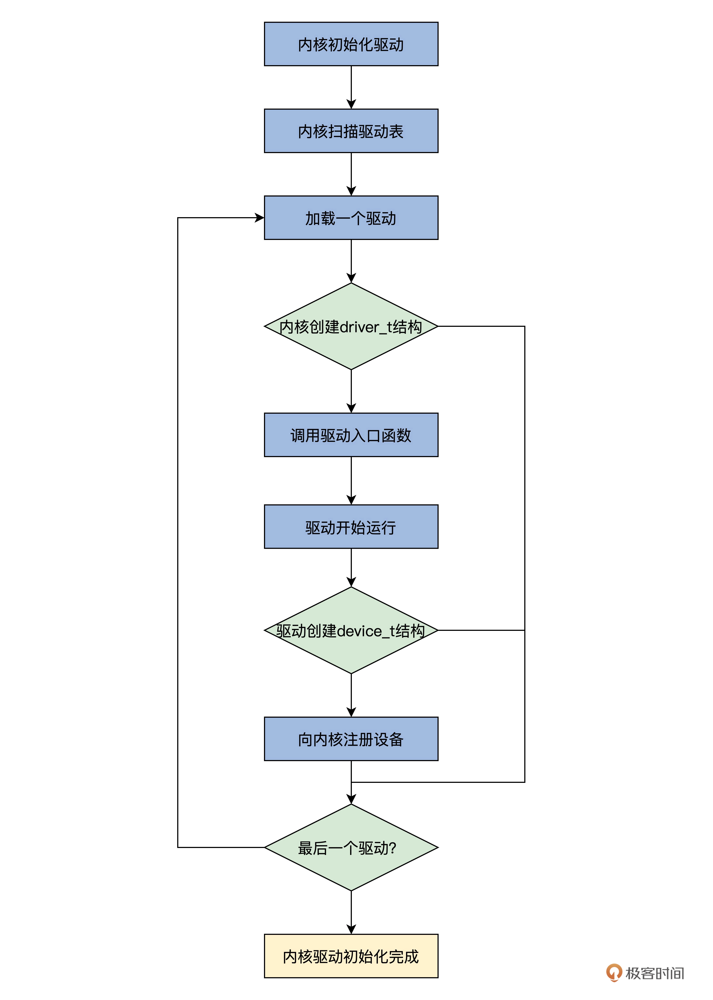

## 如何在内核中注册设备？

先从全局了解一下设备的注册流程，然后了解怎么加载驱动，最后探索怎么让驱动建立一个设备，并在内核中注册。

### 设备的注册流程

1. 操作系统会收到一个中断。
2. USB 总线驱动的中断处理程序会执行。
3. 调用操作系统内核相关的服务，查找 USB 鼠标对应的驱动程序。
4. 操作系统加载驱动程序。
5. 驱动程序开始执行，向操作系统内核注册一个鼠标设备。

### 驱动程序表（类似于中断向量表？） 

加载程序不仅仅是把驱动程序放在内存中就可以了，还要进行程序链接相关的操作，这个操作极其复杂

我们把内核和驱动程序链接在了一起，就需要有个机制让内核知道驱动程序的存在。这个机制就是驱动程序表

### 运行驱动程序
### 调用驱动程序入口函数
### 一个驱动程序入口函数的例子
### 设备与驱动的联系
### 向内核注册设备
### 安装中断回调函数
### 驱动加入内核
### 思考题
### question

