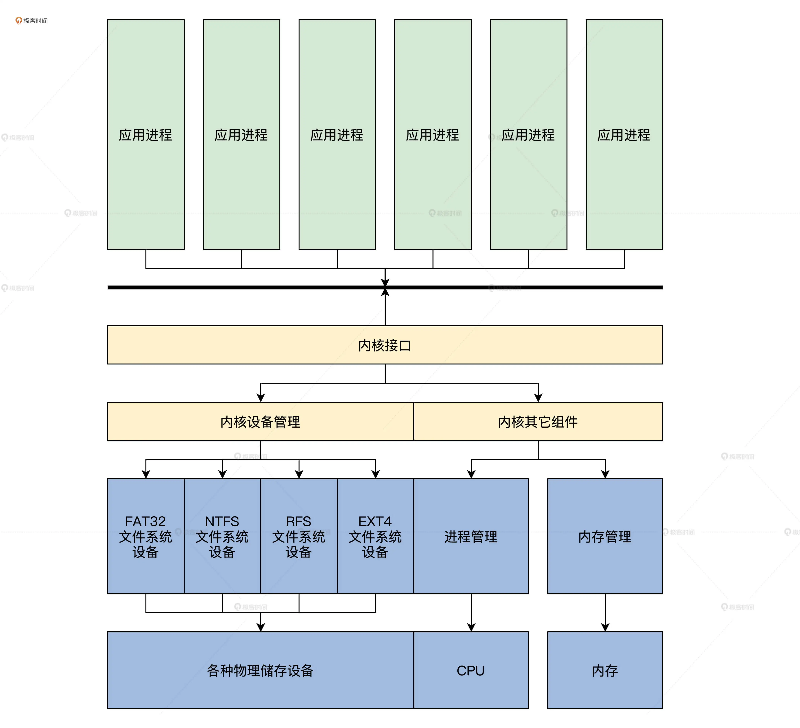
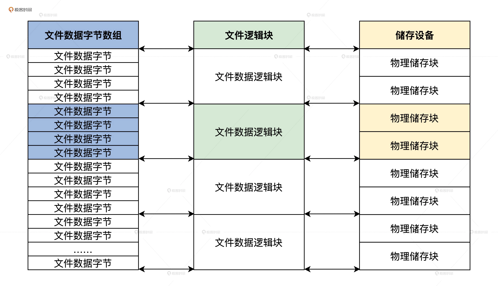
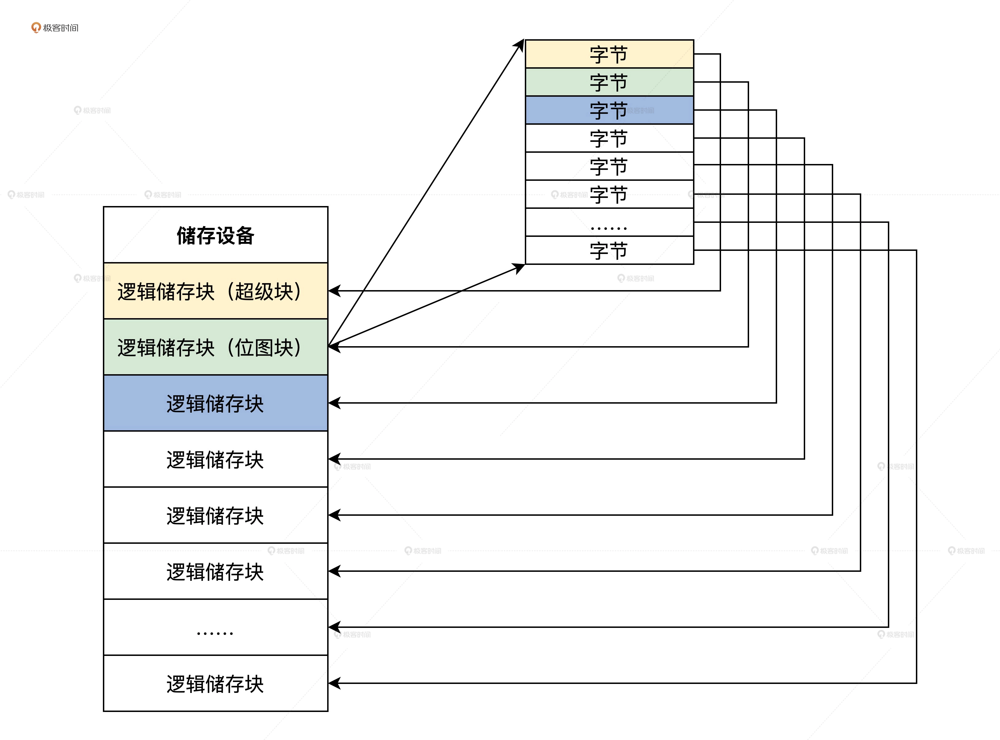
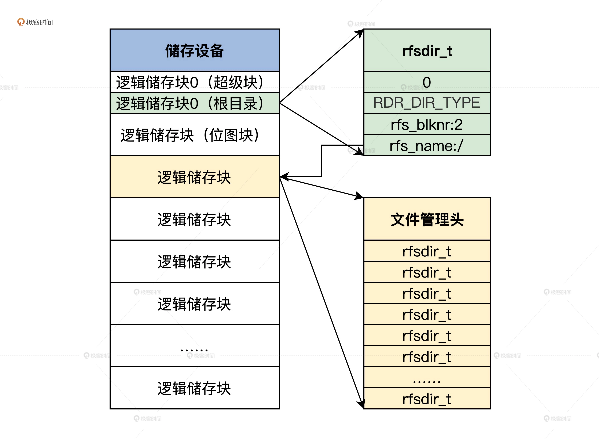

## 仓库结构：如何组织文件?

### 什么是文件系统
### 文件系统设计

1. 文件系统为什么可以是一个设备开始，以及它在整个 Cosmos 内核中的位置格局？
2. 文件数据的格式以及储存介质的最小单位是什么？
3. 如何组织越来越多的文件。

### 文件系统只是一个设备

1. 文件系统组件是独立的与内核分开的；
2. 操作系统需要动态加载和删除不同的文件系统组件，这样就可以适应复杂的情况了。



### 文件格式与存储快



### 如何组织文件
### 文件系统数据结构
### 超级块

一个文件系统有很多重要的信息，例如文件系统标识、版本、状态，储存介质大小，文件系统逻辑储存块大小，位图所在的储存块，还有根目录等。因为这些信息很重要，没有它们就等于没有文件系统，所以包含这些信息的数据结构，就叫做文件系统的超级块或者文件系统描述块。

### 位图

怎么来标识哪些逻辑储存块是空闲的，哪些逻辑储存块是已经分配占用的呢？



### 文件目录



### 文件管理头（类似于inode）

### 思考题

我们文件系统的储存单位为什么要自定义一个逻辑储存块？

### question

```sh

一、数据结构
1、rfs文件系统大小为4M，直接存放于内存中，这样就可以忽略硬件读取的细节，专注于文件系统的实现。
2、文件系统的最前面4K，是 rfssublk_t超级块结构，用于描述整个文件系统的类型、版本、状态、超级块大小、位图块位置、根目录等。而且4K并没有全部被使用。
3、4M空间被划分为1024个4K的逻辑块，用位图表示逻辑块的占用情况，1表示可用，0表示不可用；
为了计算方便，奢侈了一把，用一个字节作为一位，实际占用了1K空间，连一个逻辑块4K都没能用完。
位图逻辑块地址记录在了超级块中，位图实际上被放到了第2个逻辑块中。
4、有文件系统，就要有目录，使用 rfsdir_t结构描述目录结构，长度位128字节。而根目录所在逻辑块直接记录在了超级块中。
rfsdir_t结构，可以指向目录也可以指向文件，通过rdr_type表示了所指向逻辑块中存放的数据类型。
如果所指向类型为目录，则指向的逻辑块，前512字节为文件管理头，后续都是rfsdir_t结构
如果所指向类型为文件，则指向的逻辑块，前512字节为文件管理头，后续都是文件内容
5、文件，使用 fimgrhd_t结构表示，包括了文件名，文件类型，文件大小，访问记录等。
fimgrhd_t存放于文件的第一个逻辑储存块的首个 512 字节。
文件较小时，通过 filblks_t数组，按文件顺序，记录多个连续的逻辑块。
如果连续存储块超出FBLKS_MAX个，会再申请一个 fmd_linknblk结构，并用当前 fmd_linknblk指向新的逻辑块，并将新逻辑块的fmd_linkpblk指向当前存储块，然后，在新的逻辑存储块中继续记录文件信息。

```