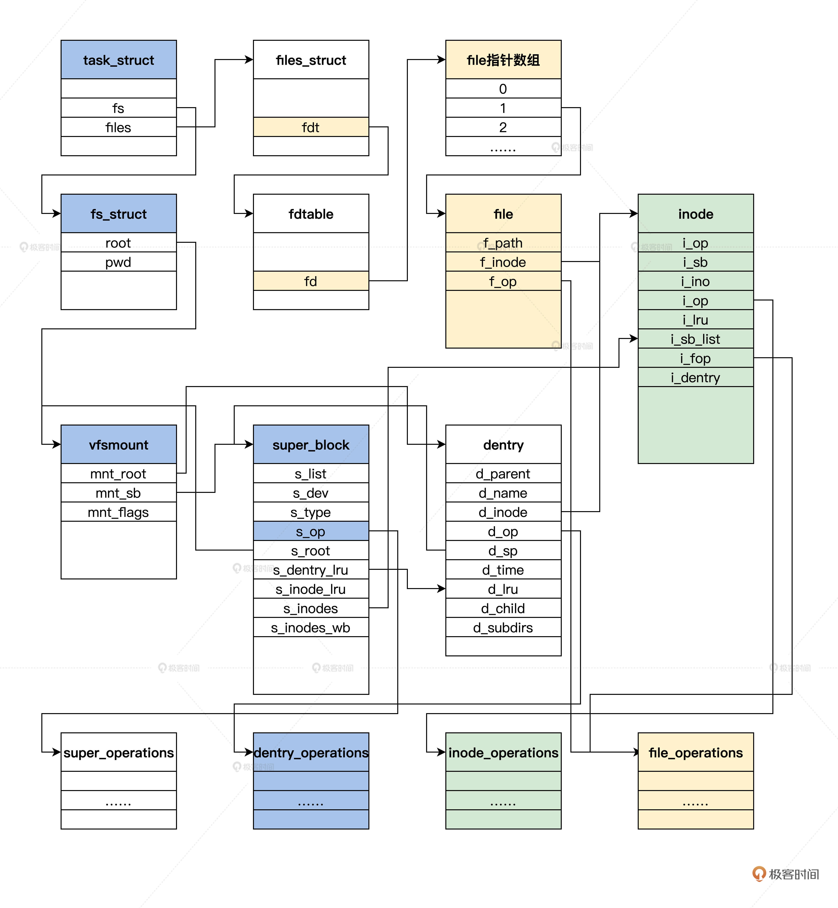

## 瞧一瞧Linux：虚拟文件系统如何管理文件？

**一切皆为文件**

首先搞清楚什么是 VFS，接着理清为了实现 VFS 所用到的数据结构，然后看看一个文件的打开、读写、关闭的过程，最后我们还要亲自动手实践，在 VFS 下实现一个“小”且“能跑”的文件系统。

### 什么是VFS（文件系统抽象层）


### VFS数据结构

VFS 为了屏蔽各个文件系统的差异，就必须要定义一组通用的数据结构，规范各个文件系统的实现，每种结构都对应一套回调函数集合，这是典型的面向对象的设计方法。

这些数据结构包含描述文件系统信息的超级块、表示文件名称的目录结构、描述文件自身信息的索引节点结构、表示打开一个文件的实例结构。

### 超级块结构
### 目录结构


### 文件索引节点（inode）
### 打开的文件
### 四大对象结构的关系



### 文件操作

Linux 下常规的文件操作就是打开、读、写、关闭

### 打开文件


### 读写文件


### 关闭文件


## 文件系统实例

trfs，这是一个内存文件系统，支持文件的建立、打开、读写、关闭等操作，通过内存块存放数据。

### 注册trfs
### 使用trfs

### 思考题

super_block，dentry，inode 这三个数据结构 ，一定要在储存设备上对应存在吗？

### question

```sh

一、数据结构
1、四大基本结构
A、超级块管理为super_block，用于描述存储设备上的文件系统，可以从super_block出发把存储设备上的内容读取出来
B、目录结构管理为dentry，通过其来组织整个目录结构
C、文件索引节点管理为inode，可以先把它看作是存储设备上的具体对象，一个inode可以对应多个dentry【比如link】
D、文件管理为file，描述进程中的某个文件对象

2、Linux在挂载文件系统时，会读取文件系统超级块super_block，然后从超级块出发读取并构造全部dentry目录结构；dentry目录结构指向存储设备文件时，是一个个的inode结构。

3、应用程序在打开文件时，在进程结构task_struct->fs_struct中，记录进程相关的文件系统信息，这样就可以对文件系统，进行新增、删除、打开、关闭等相关操作。

4、同时，在进程结构task_struct->files_struct->fdtable->file，保存全部打开的文件指针，文件指针file结构中，会保存inode指针，从而可以获取文件权限、文件访问记录、文件数据块号的信息，进一步可以从文件读取文件信息。

二、trfs demo
1、除上面的结构外，内部使用了两个结构：文件描述fileinfo，目录描述dir_entry
A、fileinfo记录在了inode的私有数据中，这样通过inode就可以方便的找到fileinfo
B、如果是文件，fileinfo.data中记录的就是文件内容
C、如果是文件夹，fileinfo.data记录的就是一个个dir_entry

2、trfs基于非连续内存
A、由MAX_FILES+1个fileinfo组成，记录在全局变量finfo_arr中，但第0和第MAX_FILES个好像没有使用
B、每个fileinfo中包含一个文件块，大小为MAX_BLOCKSIZE
C、并没有使用单独的位图，而是通过每个fileinfo来记录其使用情况的

3、初始化
A、初始化了finfo_arr结构
trfs_init->init_fileinfo

B、超级块创建，占用了finfo_arr[1]
trfs_mount->mount_nodev->trfs_fill_super

4、使用
A、每次新建文件或文件夹，就占用一个空闲的fileinfo
B、删除文件或文件夹，就将一个fileinfo设置为可用
C、读写文件就是通过file找到fileinfo.data
D、查找和枚举就是通过file找到fileinfo.data，然后访问其中的每个dir_entry

```