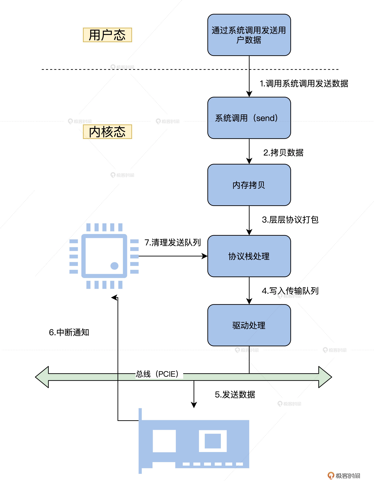
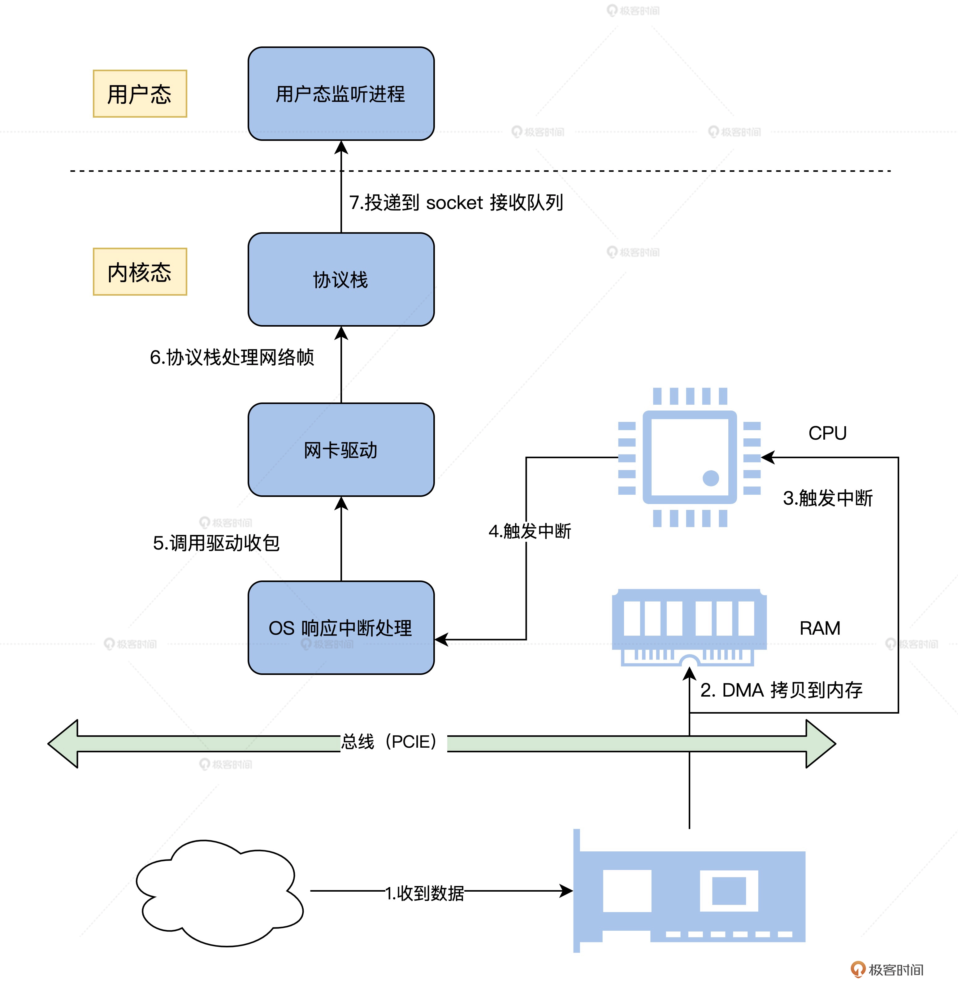

## 从内核到应用：网络数据在内核中如何流转

凡事先问目的，在网络数据在内核中的流转，最终要服务于网络收发功能。所以，我会先带你了解一次具体的网络发收过程，然后带你了解 lwIP 的网络数据收发。有了这些基础，我还会示范一下如何实现协议栈移植，你可以在课后自行动手拓展。

### 发送过程总览

应用程序首先会准备好数据，调用用户态下的库函数。接着调用系统 API 接口函数，进入到内核态。

内核态对应的系统服务函数会复制应用程序的数据到内核的内存空间中，然后将数据移交给网络协议栈，在网络协议栈中将数据层层打包。

最后，包装好的数据会交给网卡驱动，网卡驱动程序负责将打包好的数据写入网卡并让其发送出去。

### 接收过程总览

首先，网卡接受到数据，通过 DMA 复制到指定的内存

接着发送中断，以便通知网卡驱动，由网卡驱动处理中断复制数据。

然后网络协议收到网卡驱动传过来的数据，层层解包，获取真正的有效数据。

最后，这个数据会发送给用户态监听的应用进程。

### IwIP
### 思考题

我们已经了解到了操作系统内核和网络协议栈的关系，可是网络协议栈真的一定只能放在内核态实现么？

### question

1. IwIP做了些什么