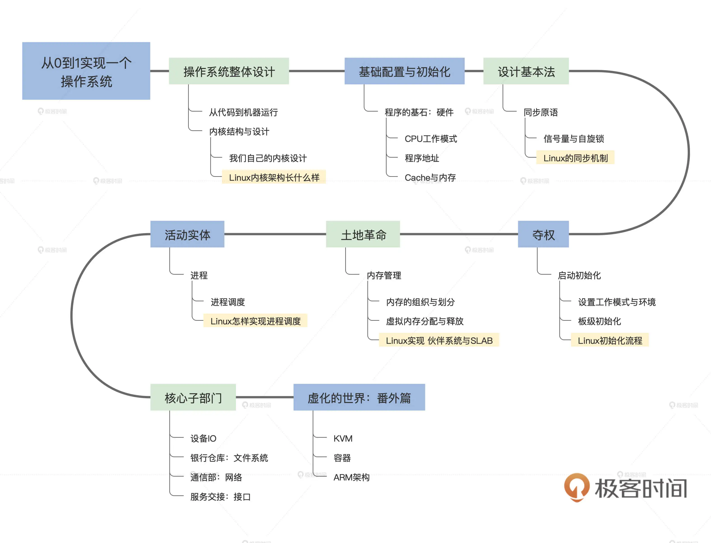

## 问题

    10~15 启动初始化 
    16~21 内存 
    24~26 进程
    28~30 IO
    32~33 文件系统
    36~40 网络 IwIP

没有实现线程，何解？

### tools

（ graph easy） 绘制ascii简易流程图

### 课程如何安排

从了解计算机王国的资源开始，如 CPU、MMU、内存和 Cache。其次要为这个权力中枢设计基本法，即各种同步机制，如信号量与自旋锁。接着进行夺权，从固件程序的手中抢过计算机并进行初始化，其中包含初始化 CPU、内存、中断、显示等。

然后，开始建设中枢的各级部门，它们分别是：内存管理部门、进程管理部门、I/O 管理部门、文件管理部门、通信管理部门。最后将这些部门组合在一起，就形成了计算机王国的权力中枢——操作系统。

### Resource

[课程源代码](https://gitee.com/lmos/cosmos)

[【操作系统实战】交流群核心问题汇总](https://shimo.im/docs/PgF2AVpTWWg7LPAR)