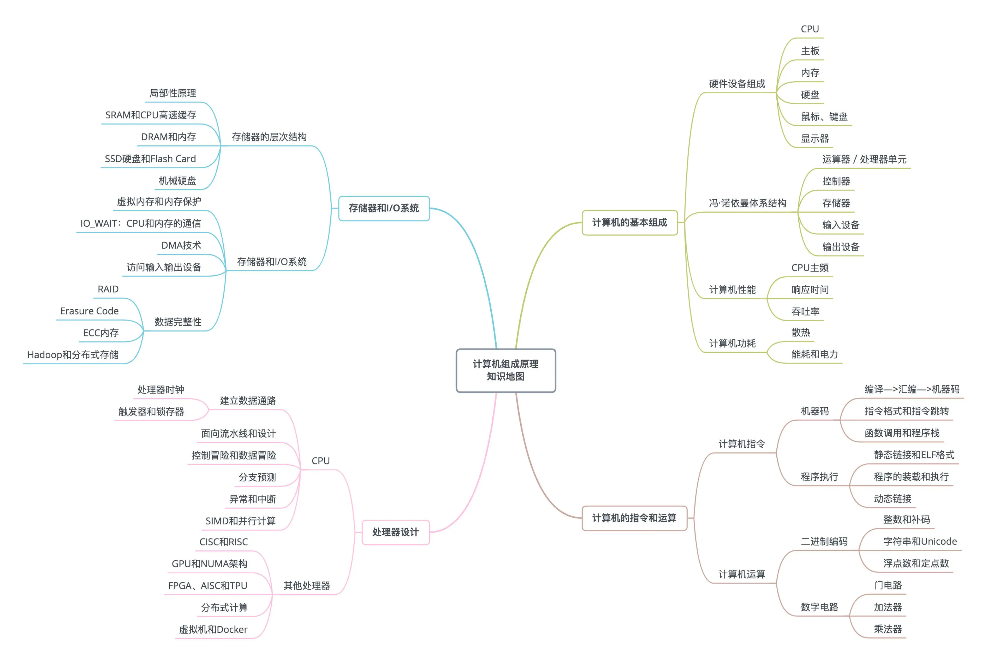

## 计算机组成原理知识图谱

在这张图里面，我们把整个计算机组成原理的知识点拆分成了四大部分，分别是计算机的基本组成、计算机的指令和计算、处理器设计，以及存储器和 I/O 设备。

### 计算机的基本组成

这一部分，你需要学习计算机是由哪些硬件组成的。这些硬件，又是怎么对应到经典的冯·诺依曼体系结构中的，也就是运算器、控制器、存储器、输入设备和输出设备这五大基本组件。除此之外，你还需要了解计算机的两个核心指标，性能和功耗。性能和功耗也是我们在应用和设计五大基本组件中需要重点考虑的因素。

### 计算机的指令和计算

在计算机指令部分，你需要搞明白，我们每天撰写的一行行 C、Java、PHP 程序，是怎么在计算机里面跑起来的。这里面，你既需要了解我们的程序是怎么通过编译器和汇编器，变成一条条机器指令这样的编译过程（如果把编译过程展开的话，可以变成一门完整的编译原理课程），还需要知道我们的操作系统是怎么链接、装载、执行这些程序的（这部分知识如果再深入学习，又可以变成一门操作系统课程）。而这一条条指令执行的控制过程，就是由计算机五大组件之一的控制器来控制的。

在计算机的计算部分，你要从二进制和编码开始，理解我们的数据在计算机里的表示，以及我们是怎么从数字电路层面，实现加法、乘法这些基本的运算功能的。实现这些运算功能的 ALU（Arithmetic Logic Unit/ALU），也就是算术逻辑单元，其实就是我们计算机五大组件之一的运算器。

这里面有一个在今天看起来特别重要的知识点，就是浮点数（Floating Point）。浮点数是我们在日常运用中非常容易用错的一种数据表示形式。掌握浮点数能让你对数据的编码、存储和计算能够有一个从表到里的深入理解。尤其在 AI 火热的今天，浮点数是机器学习中重度使用的数据表示形式，掌握它更是非常有必要。

### CPU 的设计

CPU 时钟可以用来构造寄存器和内存的锁存器和触发器，因此，CPU 时钟应该是我们学习 CPU 的前导知识。搞明白我们为什么需要 CPU 时钟（CPU Clock），以及寄存器和内存是用什么样的硬件组成的之后，我们可以再来看看，整个计算机的数据通路是如何构造出来的。

数据通路，其实就是连接了整个运算器和控制器，并最终组成了 CPU。而出于对于性能和功耗的考虑，你要进一步理解和掌握面向流水线设计的 CPU、数据和控制冒险，以及分支预测的相关技术。

既然 CPU 作为控制器要和输入输出设备通信，那么我们就要知道异常和中断发生的机制。在 CPU 设计部分的最后，我会讲一讲指令的并行执行，看看如何直接在 CPU 层面，通过 SIMD 来支持并行计算。

### 存储器的原理

通过存储器的层次结构作为基础的框架引导，你需要掌握从上到下的 CPU 高速缓存、内存、SSD 硬盘和机械硬盘的工作原理，它们之间的性能差异，以及实际应用中利用这些设备会遇到的挑战。存储器其实很多时候又扮演了输入输出设备的角色，所以你需要进一步了解，CPU 和这些存储器之间是如何进行通信的，以及我们最重视的性能问题是怎么一回事；理解什么是 IO_WAIT，如何通过 DMA 来提升程序性能。

对于存储器，我们不仅需要它们能够正常工作，还要确保里面的数据不能丢失。于是你要掌握我们是如何通过 RAID、Erasure Code、ECC 以及分布式 HDFS，这些不同的技术，来确保数据的完整性和访问性能。

### 学习计算机组成原理的方法

1. 学会提问自己来串联知识点

- 我写的程序，是怎样从输入的代码，变成运行的程序，并得到最终结果的？
- 整个过程中，计算器层面到底经历了哪些步骤，有哪些地方是可以优化的？

2. 写一些示例程序来验证知识点

3. 通过和计算机硬件发展的历史做对照

现代计算机用的各个技术，都是跟随实际应用中遇到的挑战，一个个发明、打磨，最后保留下来的。这当中不仅仅有学术层面的碰撞，更有大量商业层面的交锋。通过了解充满戏剧性和故事性的计算机硬件发展史，让你更容易理解计算机组成中各种原理的由来。