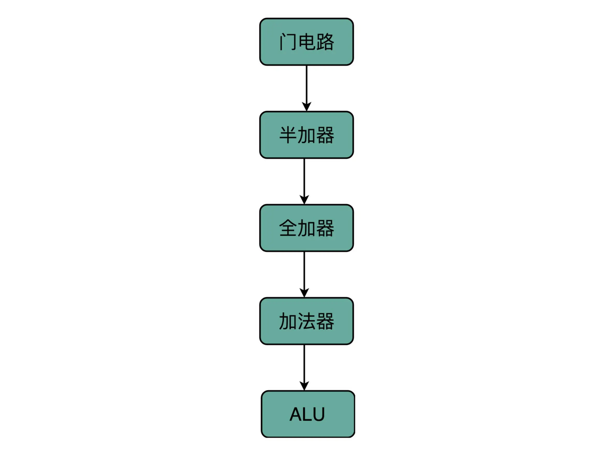

## 加法器：如何像搭乐高一样搭电路（上）？

常见门电路：与门，或门，非门/反向器，或非门，异或门，与非门

### 异或门和半加器

讲与、或、非门的时候，我们很容易就能和程序里面的“AND（通常是 & 符号）”“ OR（通常是 | 符号）”和“ NOT（通常是 ! 符号）”对应起来。可能你没有想过，**为什么我们会需要“异或（XOR）”**，这样一个在逻辑运算里面没有出现的形式，作为一个基本电路。其实，异或门就是一个最简单的整数加法，所需要使用的基本门电路。

算完个位的输出还不算完，输入的两位都是 11 的时候，我们还需要向更左侧的一位进行进位。那这个就对应一个与门，也就是有且只有在加数和被加数都是 1 的时候，我们的进位才会是 1。

所以，通过**一个异或门计算出个位，通过一个与门计算出是否进位**，我们就通过电路算出了一个一位数的加法。于是，我们把两个门电路打包，给它取一个名字，就叫作**半加器（Half Adder）**。

### 全加器

半加器可以解决个位的加法问题，但是如果放到二位上来说，就不够用了。我们这里的竖式是个二进制的加法，所以如果从右往左数，第二列不是十位，我称之为“二位”。对应的再往左，就应该分别是四位、八位。

二位用一个半加器不能计算完成的原因也很简单。因为二位除了一个加数和被加数之外，还需要加上来自个位的进位信号，一共需要三个数进行相加，才能得到结果。但是我们目前用到的，无论是最简单的门电路，还是用两个门电路组合而成的半加器，输入都只能是两个 bit，也就是两个开关。那我们该怎么办呢？

实际上，解决方案也并不复杂。**我们用两个半加器和一个或门，就能组合成一个全加器。**

通过两个半加器和一个或门，我们就得到了一个，能够接受进位信号、加数和被加数，这样三个数组成的加法。这就是我们需要的全加器。

有了全加器，我们要进行对应的两个 8 bit 数的加法就很容易了。我们只要把 8 个全加器串联起来就好了。个位的全加器的进位信号作为二位全加器的输入信号，二位全加器的进位信号再作为四位的全加器的进位信号。这样一层层串接八层，我们就得到了一个支持 8 位数加法的算术单元。如果要扩展到 16 位、32 位，乃至 64 位，都只需要多串联几个输入位和全加器就好了。

唯一需要注意的是，对于这个全加器，**在个位，我们只需要用一个半加器，或者让全加器的进位输入始终是 0**。因为个位没有来自更右侧的进位。而最左侧的一位输出的进位信号，表示的并不是再进一位，而是表示我们的加法是否溢出了。

既然 int 这样的 16 位的整数加法，结果也是 16 位数，那我们怎么知道加法最终是否溢出了呢？因为结果也只存得下加法结果的 16 位数。我们并没有留下一个第 17 位，来记录这个加法的结果是否溢出。

看到全加器的电路设计，相信你应该明白，在整个加法器的结果中，我们其实有一个电路的信号，会标识出加法的结果是否溢出。我们可以把这个对应的信号，输出给到硬件中其他标志位里，让我们的计算机知道计算的结果是否溢出。而现代计算机也正是这样做的。这就是为什么你在撰写程序的时候，能够知道你的计算结果是否溢出在硬件层面得到的支持。

### 总结

当我们想要搭建一个摩天大楼，我们需要很多很多楼梯。但是这个时候，我们已经不再关注最基础的一节楼梯是怎么用一块块积木搭建起来的。这其实就是计算机中，无论软件还是硬件中一个很重要的设计思想，**分层**。

从简单到复杂，我们一层层搭出了拥有更强能力的功能组件。在上面的一层，我们只需要考虑怎么用下一层的组件搭建出自己的功能，而不需要下沉到更低层的其他组件。就像你之前并没有深入学习过计算机组成原理，一样可以直接通过高级语言撰写代码，实现功能。

在硬件层面，我们通过门电路、半加器、全加器一层层搭出了加法器这样的功能组件。我们把这些用来做算术逻辑计算的组件叫作 ALU，也就是算术逻辑单元。当进一步打造强大的 CPU 时，我们不会再去关注最细颗粒的门电路，只需要把门电路组合而成的 ALU，当成一个能够完成基础计算的黑盒子就可以了。

以此类推，后面我们讲解 CPU 的设计和数据通路的时候，我们以 ALU 为一个基础单元来解释问题，也就够了。

### 思考题

如果是使用补码表示的有符号数，这个加法器是否可以实现正数加负数这样的运算呢？如果不行，我们应该怎么搭建对应的电路呢？

### question

1. 全加器没太懂
2. 【超前进位加法器】——北大计组