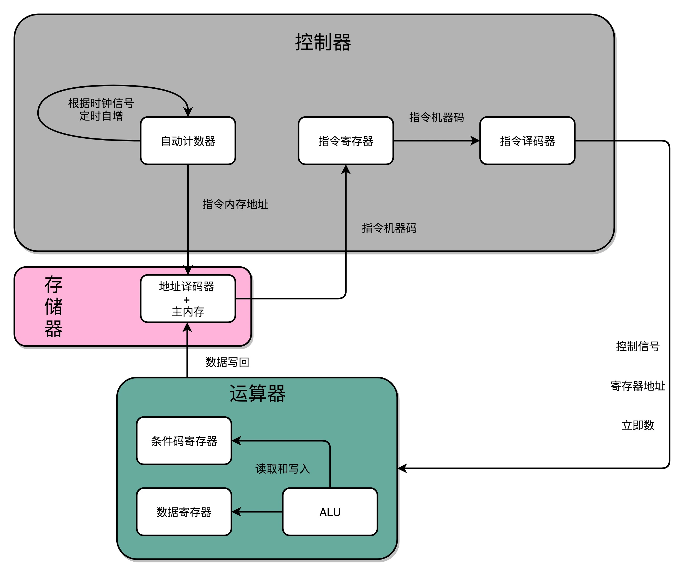

## 建立数据通路（下）：指令+运算=CPU

通过一个时钟信号，我们可以实现计数器，这个会成为我们的 PC 寄存器。然后，我们还需要一个能够帮我们在内存里面寻找指定数据地址的译码器，以及解析读取到的机器指令的译码器。这样，我们就能把所有学习到的硬件组件串联起来，变成一个 CPU，实现我们在计算机指令的执行部分的运行步骤。

### PC 寄存器所需要的计数器（程序计数器）

有了时钟信号，我们可以提供定时的输入；有了 D 型触发器，我们可以在时钟信号控制的时间点写入数据。我们把这两个功能组合起来，就可以实现一个自动的计数器了。

加法器的两个输入，一个始终设置成 1，另外一个来自于一个 D 型触发器 A。我们把加法器的输出结果，写到这个 D 型触发器 A 里面。于是，D 型触发器里面的数据就会在固定的时钟信号为 1 的时候更新一次。

这样，我们就有了一个每过一个时钟周期，就能固定自增 1 的自动计数器了。这个自动计数器，可以拿来当我们的 PC 寄存器。事实上，PC 寄存器的这个 PC，英文就是 Program Counter，也就是程序计数器的意思。

每次自增之后，我们可以去对应的 D 型触发器里面取值，这也是我们下一条需要运行指令的地址。前面第 5 讲我们讲过，同一个程序的指令应该要顺序地存放在内存里面。这里就和前面对应上了，顺序地存放指令，就是为了让我们通过程序计数器就能定时地不断执行新指令。

加法计数、内存取值，乃至后面的命令执行，最终其实都是由我们一开始讲的时钟信号，来控制执行时间点和先后顺序的，这也是我们需要时序电路最核心的原因。

在最简单的情况下，我们需要让每一条指令，从程序计数，到获取指令、执行指令，都在一个时钟周期内完成。如果 PC 寄存器自增地太快，程序就会出错。因为前一次的运算结果还没有写回到对应的寄存器里面的时候，后面一条指令已经开始读取里面的数据来做下一次计算了。这个时候，如果我们的指令使用同样的寄存器，前一条指令的计算就会没有效果，计算结果就错了。

在这种设计下，我们需要在一个时钟周期里，确保执行完一条最复杂的 CPU 指令，也就是耗时最长的一条 CPU 指令。这样的 CPU 设计，我们称之为**单指令周期处理器**（Single Cycle Processor）。

很显然，这样的设计有点儿浪费。因为即便只调用一条非常简单的指令，我们也需要等待整个时钟周期的时间走完，才能执行下一条指令。在后面章节里我们会讲到，通过流水线技术进行性能优化，可以减少需要等待的时间，这里我们暂且说到这里。

### 读写数据所需要的译码器

现在，我们的数据能够存储在 D 型触发器里了。如果我们把很多个 D 型触发器放在一起，就可以形成一块很大的存储空间，甚至可以当成一块内存来用。像我现在手头这台电脑，有 16G 内存。那我们怎么才能知道，写入和读取的数据，是在这么大的内存的哪几个比特呢？

于是，我们就需要有一个电路，来完成“寻址”的工作。这个“寻址”电路，就是我们接下来要讲的**译码器**。

其实译码器的本质，就是从输入的多个位的信号中，根据一定的开关和电路组合，选择出自己想要的信号。除了能够进行“寻址”之外，我们还可以把对应的需要运行的指令码，同样通过译码器，找出我们期望执行的指令，也就是在之前我们讲到过的 opcode，以及后面对应的操作数或者寄存器地址。只是，这样的“译码器”，比起 2-1 选择器和 3-8 译码器，要复杂的多。

### 建立数据通路，构造一个最简单的 CPU

D 触发器、自动计数以及译码器，再加上一个我们之前说过的 ALU，我们就凑齐了一个拼装一个 CPU 必须要的零件了。下面，我们就来看一看，怎么把这些零件组合起来，才能实现指令执行和算术逻辑计算的 CPU。

1. 首先，我们有一个自动计数器。这个自动计数器会随着时钟主频不断地自增，来作为我们的 PC 寄存器。
2. 在这个自动计数器的后面，我们连上一个译码器。译码器还要同时连着我们通过大量的 D 触发器组成的内存。
3. 自动计数器会随着时钟主频不断自增，从译码器当中，找到对应的计数器所表示的内存地址，然后读取出里面的 CPU 指令。
4. 读取出来的 CPU 指令会通过我们的 CPU 时钟的控制，写入到一个由 D 触发器组成的寄存器，也就是指令寄存器当中。
5. 在指令寄存器后面，我们可以再跟一个译码器。这个译码器不再是用来寻址的了，而是把我们拿到的指令，解析成 opcode 和对应的操作数。
6. 当我们拿到对应的 opcode 和操作数，对应的输出线路就要连接 ALU，开始进行各种算术和逻辑运算。对应的计算结果，则会再写回到 D 触发器组成的寄存器或者内存当中。

这样的一个完整的通路，也就完成了我们的 CPU 的一条指令的执行过程。在这个过程中，你会发现这样几个有意思的问题。

第一个，是我们之前在第 6 讲讲过的程序跳转所使用的条件码寄存器。那时，讲计算机的指令执行的时候，我们说高级语言中的 if…else，其实是变成了一条 cmp 指令和一条 jmp 指令。cmp 指令是在进行对应的比较，比较的结果会更新到条件码寄存器当中。jmp 指令则是根据条件码寄存器当中的标志位，来决定是否进行跳转以及跳转到什么地址。

不知道你当时看到这个知识点的时候，有没有一些疑惑，**为什么我们的 if…else 会变成这样两条指令，而不是设计成一个复杂的电路，变成一条指令？**到这里，我们就可以解释了。这样分成两个指令实现，完全匹配好了我们在电路层面，“译码 - 执行 - 更新寄存器“这样的步骤。

cmp 指令的执行结果放到了条件码寄存器里面，我们的条件跳转指令也是在 ALU 层面执行的，而不是在控制器里面执行的。这样的实现方式在电路层面非常直观，我们不需要一个非常复杂的电路，就能实现 if…else 的功能。

(question  这里没看懂)
第二个，是关于我们在第17 讲里讲到的指令周期、CPU 周期和时钟周期的差异。在上面的抽象的逻辑模型中，你很容易发现，我们执行一条指令，其实可以不放在一个时钟周期里面，可以直接拆分到多个时钟周期。

我们可以在一个时钟周期里面，去自增 PC 寄存器的值，也就是指令对应的内存地址。然后，我们要根据这个地址从 D 触发器里面读取指令，这个还是可以在刚才那个时钟周期内。但是对应的指令写入到指令寄存器，我们可以放在一个新的时钟周期里面。指令译码给到 ALU 之后的计算结果，要写回到寄存器，又可以放到另一个新的时钟周期。所以，执行一条计算机指令，其实可以拆分到很多个时钟周期，而不是必须使用单指令周期处理器的设计。

因为从内存里面读取指令时间很长，所以如果使用单指令周期处理器，就意味着我们的指令都要去等待一些慢速的操作。这些不同指令执行速度的差异，也正是计算机指令有指令周期、CPU 周期和时钟周期之分的原因。因此，现代我们优化 CPU 的性能时，用的 CPU 都不是单指令周期处理器，而是通过流水线、分支预测等技术，来实现在一个周期里同时执行多个指令。

### 思考题

CPU 在执行无条件跳转的时候，不需要通过运算器以及 ALU，可以直接在控制器里面完成，你能说说这是为什么吗？

### question