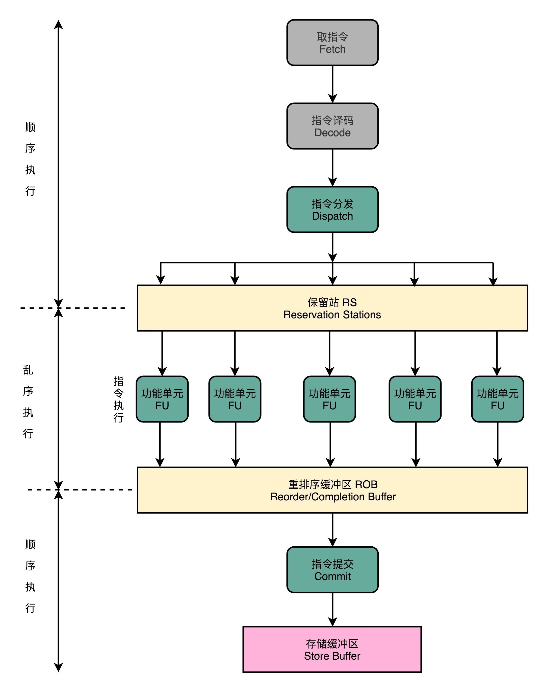

## 冒险和预测（三）：CPU里的“线程池”

我为你讲解了通过增加资源、停顿等待以及主动转发数据的方式，来解决结构冒险和数据冒险问题。对于结构冒险，由于限制来自于同一时钟周期不同的指令，要访问相同的硬件资源，解决方案是增加资源。对于数据冒险，由于限制来自于数据之间的各种依赖，我们可以提前把数据转发到下一个指令。

但是即便综合运用这三种技术，我们仍然会遇到不得不停下整个流水线，等待前面的指令完成的情况，也就是采用流水线停顿的解决方案

那这个时候你就会想了，那我们能不能让后面没有数据依赖的指令，在前面指令停顿的时候先执行呢？答案当然是可以的。毕竟，流水线停顿的时候，对应的电路闲着也是闲着。那我们完全可以先完成后面指令的执行阶段。

### 填上空闲的 NOP：上菜的顺序不必是点菜的顺序

在流水线里，后面的指令不依赖前面的指令，那就不用等待前面的指令执行，它完全可以先执行。

这就好比你开了一家餐馆，顾客会排队来点菜。餐馆的厨房里会有洗菜、切菜、炒菜、上菜这样的各个步骤。后厨也是按照点菜的顺序开始做菜的。但是不同的菜需要花费的时间和工序可能都有差别。有些菜做起来特别麻烦，特别慢。比如做一道佛跳墙有好几道工序。我们没有必要非要等先点的佛跳墙上菜了，再开始做后面的炒鸡蛋。只要有厨子空出来了，就可以先动手做前面的简单菜，先给客户端上去。

这样的解决方案，在计算机组成里面，被称为乱序执行（Out-of-Order Execution，OoOE）。

### CPU 里的“线程池”：理解乱序执行

那么，我们的 CPU 怎样才能实现乱序执行呢？是不是像玩俄罗斯方块一样，把后面的指令，找一个前面的坑填进去就行了？事情并没有这么简单。其实，从今天软件开发的维度来思考，乱序执行好像是在指令的执行阶段，引入了一个“线程池”。我们下面就来看一看，在 CPU 里，乱序执行的过程究竟是怎样的。使用乱序执行技术后，CPU 里的流水线就和我之前给你看的 5 级流水线不太一样了。我们一起来看一看下面这张图。

1. 在取指令和指令译码的时候，乱序执行的 CPU 和其他使用流水线架构的 CPU 是一样的。它会一级一级顺序地进行取指令和指令译码的工作。
2. 在指令译码完成之后，就不一样了。CPU 不会直接进行指令执行，而是进行一次指令分发，把指令发到一个叫作保留站（Reservation Stations）的地方。顾名思义，这个保留站，就像一个火车站一样。发送到车站的指令，就像是一列列的火车。
3. 这些指令不会立刻执行，而要等待它们所依赖的数据，传递给它们之后才会执行。这就好像一列列的火车都要等到乘客来齐了才能出发。
4. 一旦指令依赖的数据来齐了，指令就可以交到后面的功能单元（Function Unit，FU），其实就是 ALU，去执行了。我们有很多功能单元可以并行运行，但是不同的功能单元能够支持执行的指令并不相同。就和我们的铁轨一样，有些从上海北上，可以到北京和哈尔滨；有些是南下的，可以到广州和深圳。
5. 指令执行的阶段完成之后，我们并不能立刻把结果写回到寄存器里面去，而是把结果再存放到一个叫作重排序缓冲区（Re-Order Buffer，ROB）的地方。
6. 在重排序缓冲区里，我们的 CPU 会按照取指令的顺序，对指令的计算结果重新排序。只有排在前面的指令都已经完成了，才会提交指令，完成整个指令的运算结果。
7. 实际的指令的计算结果数据，并不是直接写到内存或者高速缓存里，而是先写入存储缓冲区（Store Buffer 面，最终才会写入到高速缓存和内存里。

整个乱序执行技术，就好像在指令的执行阶段提供一个“线程池”。指令不再是顺序执行的，而是根据池里所拥有的资源，以及各个任务是否可以进行执行，进行动态调度。在执行完成之后，又重新把结果在一个队列里面，按照指令的分发顺序重新排序。即使内部是“乱序”的，但是在外部看起来，仍然是井井有条地顺序执行。

乱序执行，极大地提高了 CPU 的运行效率。核心原因是，现代 CPU 的运行速度比访问主内存的速度要快很多。如果完全采用顺序执行的方式，很多时间都会浪费在前面指令等待获取内存数据的时间里。CPU 不得不加入 NOP 操作进行空转。而现代 CPU 的流水线级数也已经相对比较深了，到达了 14 级。这也意味着，同一个时钟周期内并行执行的指令数是很多的。

### 思考题

在现代 Intel 的 CPU 的乱序执行的过程中，只有指令的执行阶段是乱序的，后面的内存访问和数据写回阶段都仍然是顺序的。这种保障内存数据访问顺序的模型，叫作强内存模型（Strong Memory Model）。你能想一想，我们为什么要保障内存访问的顺序呢？在前后执行的指令没有相关数据依赖的情况下，为什么我们仍然要求这个顺序呢？

### question