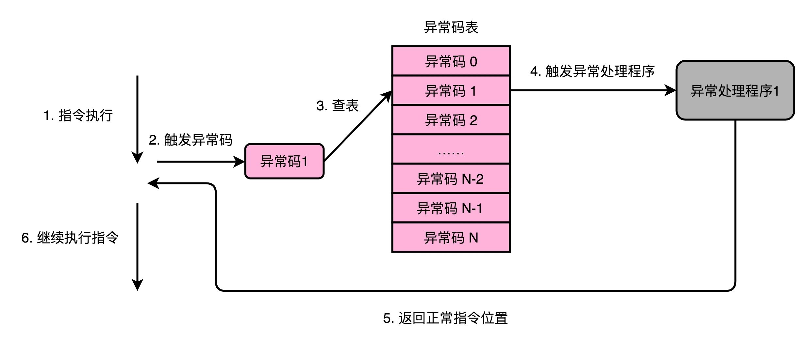

## 异常和中断：程序出错了怎么办？

### 异常：硬件、系统和应用的组合拳

现实的软件世界可没有这么简单。一方面，程序不仅是简单的执行指令，更多的还需要和外部的输入输出打交道。另一方面，程序在执行过程中，还会遇到各种异常情况，比如除以 0、溢出，甚至我们自己也可以让程序抛出异常。

那这一讲，我就带你来看看，如果遇到这些情况，计算机是怎么运转的，也就是说，计算机究竟是如何处理异常的。

### 异常：硬件、系统和应用的组合拳

**关于异常，最有意思的一点就是，它其实是一个硬件和软件组合到一起的处理过程。异常的前半生，也就是异常的发生和捕捉，是在硬件层面完成的。但是异常的后半生，也就是说，异常的处理，其实是由软件来完成的。**

计算机会为每一种可能会发生的异常，分配一个异常代码（Exception Number）。有些教科书会把异常代码叫作中断向量（Interrupt Vector）。异常发生的时候，通常是 CPU 检测到了一个特殊的信号。比如，你按下键盘上的按键，输入设备就会给 CPU 发一个信号。或者，正在执行的指令发生了加法溢出，同样，我们可以有一个进位溢出的信号。这些信号呢，在组成原理里面，我们一般叫作发生了一个事件（Event）。CPU 在检测到事件的时候，其实也就拿到了对应的异常代码。

**这些异常代码里，I/O 发出的信号的异常代码，是由操作系统来分配的，也就是由软件来设定的。而像加法溢出这样的异常代码，则是由 CPU 预先分配好的，也就是由硬件来分配的。这又是另一个软件和硬件共同组合来处理异常的过程。**

拿到异常代码之后，CPU 就会触发异常处理的流程。计算机在内存里，会保留一个异常表（Exception Table）。也有地方，把这个表叫作中断向量表（Interrupt Vector Table），好和上面的中断向量对应起来。这个异常表有点儿像我们在第 10 讲里讲的 GOT 表，存放的是不同的异常代码对应的异常处理程序（Exception Handler）所在的地址。

我们的 CPU 在拿到了异常码之后，会先把当前的程序执行的现场，保存到程序栈里面，然后根据异常码查询，找到对应的异常处理程序，最后把后续指令执行的指挥权，交给这个异常处理程序。

### 异常的分类：中断、陷阱、故障和中止

第一种异常叫**中断**（Interrupt）。顾名思义，自然就是程序在执行到一半的时候，被打断了。这个打断执行的信号，来自于 CPU 外部的 I/O 设备。你在键盘上按下一个按键，就会对应触发一个相应的信号到达 CPU 里面。CPU 里面某个开关的值发生了变化，也就触发了一个中断类型的异常。

第二种异常叫**陷阱**（Trap）。陷阱，其实是我们程序员“故意“主动触发的异常。就好像你在程序里面打了一个断点，这个断点就是设下的一个"陷阱"。当程序的指令执行到这个位置的时候，就掉到了这个陷阱当中。然后，对应的异常处理程序就会来处理这个"陷阱"当中的猎物。

最常见的一类陷阱，发生在我们的应用程序调用系统调用的时候，也就是从程序的用户态切换到内核态的时候。我们在第 3 讲讲 CPU 性能的时候说过，可以用 Linux 下的 time 指令，去查看一个程序运行实际花费的时间，里面有在用户态花费的时间（user time），也有在内核态发生的时间（system time）。

我们的应用程序通过系统调用去读取文件、创建进程，其实也是通过触发一次陷阱来进行的。这是因为，我们用户态的应用程序没有权限来做这些事情，需要把对应的流程转交给有权限的异常处理程序来进行。

第三种异常叫**故障**（Fault）。它和陷阱的区别在于，陷阱是我们开发程序的时候刻意触发的异常，而故障通常不是。比如，我们在程序执行的过程中，进行加法计算发生了溢出，其实就是故障类型的异常。这个异常不是我们在开发的时候计划内的，也一样需要有对应的异常处理程序去处理。

故障和陷阱、中断的一个重要区别是，故障在异常程序处理完成之后，仍然回来处理当前的指令，而不是去执行程序中的下一条指令。因为当前的指令因为故障的原因并没有成功执行完成。

最后一种异常叫**中止**（Abort）。与其说这是一种异常类型，不如说这是故障的一种特殊情况。当 CPU 遇到了故障，但是恢复不过来的时候，程序就不得不中止了。

在这四种异常里，中断异常的信号来自系统外部，而不是在程序自己执行的过程中，所以我们称之为“**异步**”类型的异常。而陷阱、故障以及中止类型的异常，是在程序执行的过程中发生的，所以我们称之为“**同步**“类型的异常。

在处理异常的过程当中，无论是异步的中断，还是同步的陷阱和故障，我们都是采用同一套处理流程，也就是上面所说的，“保存现场、异常代码查询、异常处理程序调用“。而中止类型的异常，其实是在故障类型异常的一种特殊情况。当故障发生，但是我们发现没有异常处理程序能够处理这

### 异常的处理：上下文切换

在实际的异常处理程序执行之前，CPU 需要去做一次“保存现场”的操作。这个保存现场的操作，和我在第 7 讲里讲解函数调用的过程非常相似。

因为切换到异常处理程序的时候，其实就好像是去调用一个异常处理函数。指令的控制权被切换到了另外一个"函数"里面，所以我们自然要把当前正在执行的指令去压栈。这样，我们才能在异常处理程序执行完成之后，重新回到当前的指令继续往下执行。

不过，切换到异常处理程序，比起函数调用，还是要更复杂一些。原因有下面几点。

第一点，因为异常情况往往发生在程序正常执行的预期之外，比如中断、故障发生的时候。所以，除了本来程序压栈要做的事情之外，我们还需要把 CPU 内当前运行程序用到的所有寄存器，都放到栈里面。最典型的就是条件码寄存器里面的内容。

第二点，像陷阱这样的异常，涉及程序指令在用户态和内核态之间的切换。对应压栈的时候，对应的数据是压到内核栈里，而不是程序栈里。

第三点，像故障这样的异常，在异常处理程序执行完成之后。从栈里返回出来，继续执行的不是顺序的下一条指令，而是故障发生的当前指令。因为当前指令因为故障没有正常执行成功，必须重新去执行一次。

所以，对于异常这样的处理流程，不像是顺序执行的指令间的函数调用关系。而是更像两个不同的独立进程之间在 CPU 层面的切换，所以这个过程我们称之为上下文切换（Context Switch）。

### 思考题

什么是软中断，什么是硬中断吗？它们和我们今天说的中断、陷阱、故障以及中止又有什么关系呢？

### question