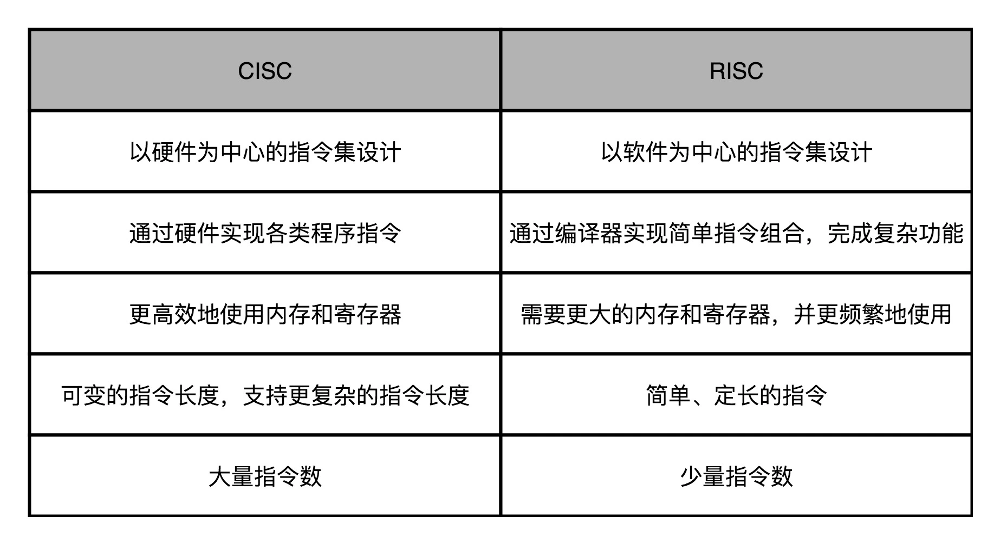

## CISC和RISC：为什么手机芯片都是ARM？

CPU 的指令集里的机器码是固定长度还是可变长度，也就是**复杂指令集**（Complex Instruction Set Computing，简称 CISC）和**精简指令集**（Reduced Instruction Set Computing，简称 RISC

### CISC VS RISC

实际在 CPU 运行的程序里，80% 的时间都是在使用 20% 的简单指令。于是，他就提出了 RISC 的理念。

总的来说，对于 CISC 和 RISC 的对比，我们可以一起回到第 4 讲讲的程序运行时间的公式：

> 程序的 CPU 执行时间 = 指令数 × CPI × Clock Cycle Time

CISC 的架构，其实就是通过优化指令数，来减少 CPU 的执行时间。而 RISC 的架构，其实是在优化 CPI。因为指令比较简单，需要的时钟周期就比较少。

### Intel 的进化：微指令架构的出现

如果你现在在 Linux 下安装各种软件包，一定经常会看到像下面这样带有 AMD64 字样的内容。这是因为 x86 下的 64 位的指令集 x86-64，并不是 Intel 发明的，而是 AMD 发明的。

在微指令架构的 CPU 里面，编译器编译出来的机器码和汇编代码并没有发生什么变化。但在指令译码的阶段，指令译码器“翻译”出来的，不再是某一条 CPU 指令。译码器会把一条机器码，“翻译”成好几条“微指令”。这里的一条条微指令，就不再是 CISC 风格的了，而是变成了固定长度的 RISC 风格的了。

不过，凡事有好处就有坏处。这样一个能够把 CISC 的指令译码成 RISC 指令的指令译码器，比原来的指令译码器要复杂。这也就意味着更复杂的电路和更长的译码时间：本来以为可以通过 RISC 提升的性能，结果又有一部分浪费在了指令译码上。针对这个问题，我们有没有更好的办法呢？

Intel 就在 CPU 里面加了一层 L0 Cache。这个 Cache 保存的就是指令译码器把 CISC 的指令“翻译”成 RISC 的微指令的结果。于是，在大部分情况下，CPU 都可以从 Cache 里面拿到译码结果，而不需要让译码器去进行实际的译码操作。这样不仅优化了性能，因为译码器的晶体管开关动作变少了，还减少了功耗。

### 
### 
### 
### 
### 思考题
### question