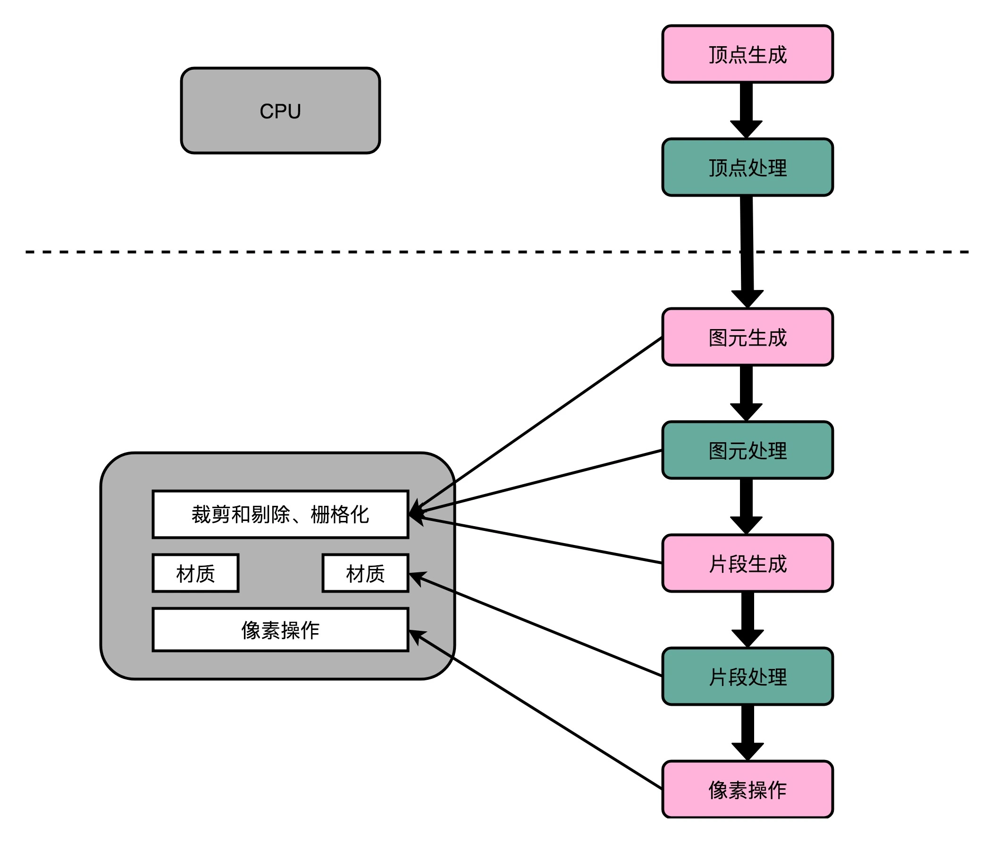

## GPU（上）：为什么玩游戏需要使用GPU？

### 图形渲染的流程(复杂)

对于图像进行实时渲染的过程，可以被分解成下面这样 5 个步骤：

    顶点处理（Vertex Processing）
    图元处理（Primitive Processing）
    栅格化（Rasterization）
    片段处理（Fragment Processing）
    像素操作（Pixel Operations）

### 解放图形渲染的 GPU

既然图形渲染的流程是固定的，那我们直接用硬件来处理这部分过程，不用 CPU 来计算是不是就好了？很显然，这样的硬件会比制造有同样计算性能的 CPU 要便宜得多。因为整个计算流程是完全固定的，不需要流水线停顿、乱序执行等等的各类导致 CPU 计算变得复杂的问题。我们也不需要有什么可编程能力，只要让硬件按照写好的逻辑进行运算就好了。

### 思考题

我们上面说的图形加速卡，可以加速 3D 图形的渲染。那么，这些显卡对于传统的 2D 图形，也能够进行加速，让 CPU 摆脱这些负担吗？

### question