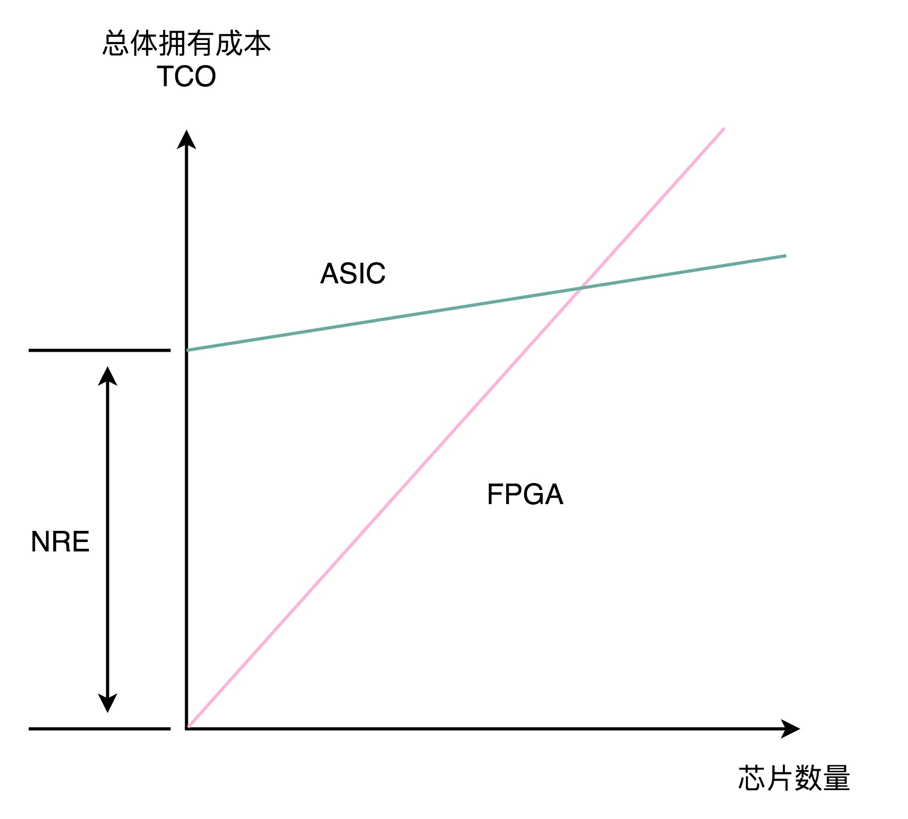

## FPGA和ASIC：计算机体系结构的黄金时代

FPGA 本质上是一个可以通过编程，来控制硬件电路的芯片。我们通过用 LUT 这样的存储设备，来代替需要的硬连线的电路，有了可编程的逻辑门，然后把很多 LUT 和寄存器放在一起，变成一个更复杂的逻辑电路，也就是 CLB，然后通过控制可编程布线中的很多开关，最终设计出属于我们自己的芯片功能。FPGA，常常被我们用来进行芯片的设计和验证工作，也可以直接拿来当成专用的芯片，替换掉 CPU 或者 GPU，以节约成本。

相比 FPGA，ASIC 在“专用”上更进一步。它是针对特定的使用场景设计出来的芯片，比如，摄像头、音频、“挖矿”或者深度学习。虽然 ASIC 的研发成本高昂，但是生产制造成本和能耗都很低。所以，对于有大量需求的专用芯片，用 ASIC 是很划得来的。而在 FPGA 和 ASIC 之间进行取舍，就要看两者的整体拥有成本哪一个更低了。

### 思考题
### question