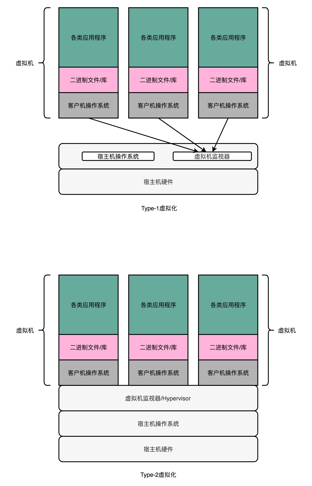
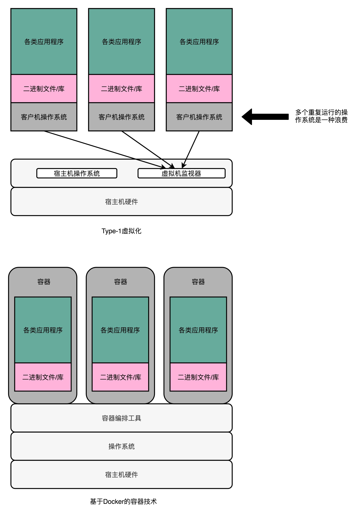

## 理解虚拟机：你在云上拿到的计算机是什么样的？

### 解释型虚拟机

要模拟一个计算机系统，最简单的办法，就是兼容这个计算机系统的指令集。我们可以开发一个应用程序，跑在我们的操作系统上。这个应用程序呢，可以识别我们想要模拟的、计算机系统的程序格式和指令，然后一条条去解释执行。

在这个过程中，我们把原先的操作系统叫作宿主机（Host），把能够有能力去模拟指令执行的软件，叫作模拟器（Emulator），而实际运行在模拟器上被“虚拟”出来的系统呢，我们叫客户机（Guest VM）。

### Type-1 和 Type-2：虚拟机的性能提升

### Docker：新时代的最佳选择？

“操作系统级虚拟机”，好和上面的全虚拟化虚拟机对应起来。不过严格来说，Docker 并不能算是一种虚拟机技术，而只能算是一种资源隔离的技术而已。

### 思考题
### question

1. 三种虚拟机，我居然只知道一种