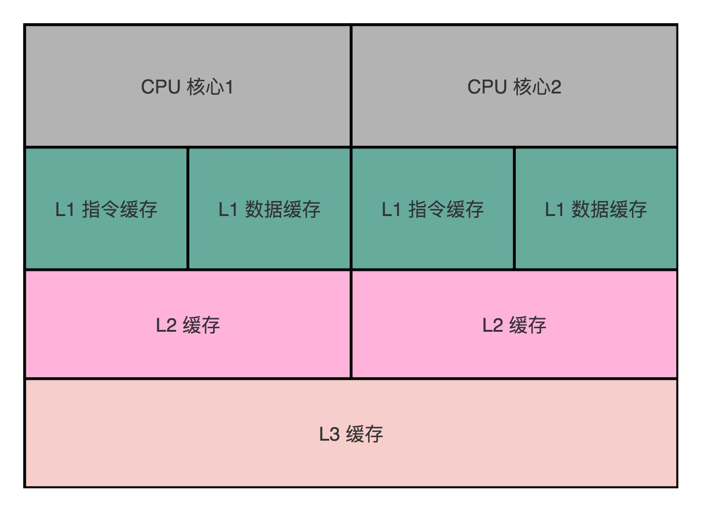
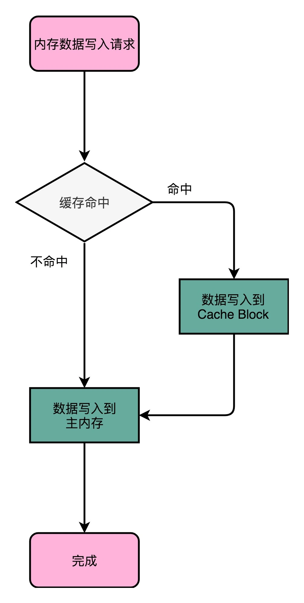
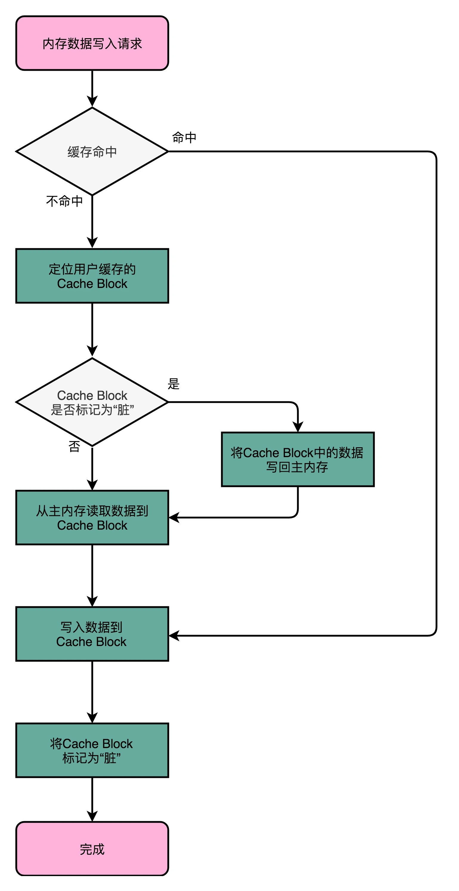

## 高速缓存（下）：你确定你的数据更新了么？

### volatile 这个关键字有什么作用？

这里面最常见的理解错误有两个，一个是把 volatile 当成一种锁机制，认为给变量加上了 volatile，就好像是给函数加了 sychronized 关键字一样，不同的线程对于特定变量的访问会去加锁；另一个是把 volatile 当成一种原子化的操作机制，认为加了 volatile 之后，对于一个变量的自增的操作就会变成原子性的了。

事实上，这两种理解都是完全错误的。很多工程师容易把 volatile 关键字，当成和锁或者数据数据原子性相关的知识点。而实际上，volatile 关键字的最核心知识点，要关系到 Java 内存模型（JMM，Java Memory Model）上。

虽然 JMM 只是 Java 虚拟机这个进程级虚拟机里的一个内存模型，但是这个内存模型，和计算机组成里的 CPU、高速缓存和主内存组合在一起的硬件体系非常相似。理解了 JMM，可以让你很容易理解计算机组成里 CPU、高速缓存和主内存之间的关系。

### “隐身”的变量

```java

public class VolatileTest {
    private static volatile int COUNTER = 0;

    public static void main(String[] args) {
        new ChangeListener().start();
        new ChangeMaker().start();
    }

    static class ChangeListener extends Thread {
        @Override
        public void run() {
            int threadValue = COUNTER;
            while ( threadValue < 5){
                if( threadValue!= COUNTER){
                    System.out.println("Got Change for COUNTER : " + COUNTER + "");
                    threadValue= COUNTER;
                }
            }
        }
    }

    static class ChangeMaker extends Thread{
        @Override
        public void run() {
            int threadValue = COUNTER;
            while (COUNTER <5){
                System.out.println("Incrementing COUNTER to : " + (threadValue+1) + "");
                COUNTER = ++threadValue;
                try {
                    Thread.sleep(500);
                } catch (InterruptedException e) { e.printStackTrace(); }
            }
        }
    }
}
```
输出结果如下：

```java

Incrementing COUNTER to : 1
Got Change for COUNTER : 1
Incrementing COUNTER to : 2
Got Change for COUNTER : 2
Incrementing COUNTER to : 3
Got Change for COUNTER : 3
Incrementing COUNTER to : 4
Got Change for COUNTER : 4
Incrementing COUNTER to : 5
Got Change for COUNTER : 5
```

把我们定义 COUNTER 这个变量的时候，设置的 volatile 关键字给去掉，会发生什么事情呢？

```java

private static int COUNTER = 0;
```
输出结果如下：

```java

Incrementing COUNTER to : 1
Incrementing COUNTER to : 2
Incrementing COUNTER to : 3
Incrementing COUNTER to : 4
Incrementing COUNTER to : 5
```


我们不再让 ChangeListener 进行完全的忙等待，而是在 while 循环里面，小小地等待上 5 毫秒，看看会发生什么情况。

```java

static class ChangeListener extends Thread {
    @Override
    public void run() {
        int threadValue = COUNTER;
        while ( threadValue < 5){
            if( threadValue!= COUNTER){
                System.out.println("Sleep 5ms, Got Change for COUNTER : " + COUNTER + "");
                threadValue= COUNTER;
            }
            try {
                Thread.sleep(5);
            } catch (InterruptedException e) { e.printStackTrace(); }
        }
    }
}
```

输出结果

```java

Incrementing COUNTER to : 1
Sleep 5ms, Got Change for COUNTER : 1
Incrementing COUNTER to : 2
Sleep 5ms, Got Change for COUNTER : 2
Incrementing COUNTER to : 3
Sleep 5ms, Got Change for COUNTER : 3
Incrementing COUNTER to : 4
Sleep 5ms, Got Change for COUNTER : 4
Incrementing COUNTER to : 5
Sleep 5ms, Got Change for COUNTER : 5
```


这些有意思的现象，其实来自于我们的 Java 内存模型以及关键字 volatile 的含义。**那 volatile 关键字究竟代表什么含义呢？它会确保我们对于这个变量的读取和写入，都一定会同步到主内存里，而不是从 Cache 里面读取。**


第一个使用了 volatile 关键字的例子里，因为所有数据的读和写都来自主内存。那么自然地，我们的 ChangeMaker 和 ChangeListener 之间，看到的 COUNTER 值就是一样的。

到了第二段进行小小修改的时候，我们去掉了 volatile 关键字。这个时候，ChangeListener 又是一个忙等待的循环，它尝试不停地获取 COUNTER 的值，这样就会从当前线程的“Cache”里面获取。于是，这个线程就没有时间从主内存里面同步更新后的 COUNTER 值。这样，它就一直卡死在 COUNTER=0 的死循环上了。

而到了我们再次修改的第三段代码里面，虽然还是没有使用 volatile 关键字，但是短短 5ms 的 Thead.Sleep 给了这个线程喘息之机。既然这个线程没有这么忙了，它也就有机会把最新的数据从主内存同步到自己的高速缓存里面了。于是，ChangeListener 在下一次查看 COUNTER 值的时候，就能看到 ChangeMaker 造成的变化了。

虽然 Java 内存模型是一个隔离了硬件实现的虚拟机内的抽象模型，但是它给了我们一个很好的“缓存同步”问题的示例。也就是说，如果我们的数据，在不同的线程或者 CPU 核里面去更新，因为不同的线程或 CPU 核有着自己各自的缓存，很有可能在 A 线程的更新，到 B 线程里面是看不见的。

### CPU 高速缓存的写入



这个层级结构，就好像我们在 Java 内存模型里面，每一个线程都有属于自己的线程栈。线程在读取 COUNTER 的数据的时候，其实是从本地的线程栈的 Cache 副本里面读取数据，而不是从主内存里面读取数据。如果我们对于数据仅仅只是读，问题还不大。我们在上一讲里，已经看到 Cache Line 的组成，以及如何从内存里面把对应的数据加载到 Cache 里。

但是，对于数据，我们不光要读，还要去写入修改。这个时候，有两个问题来了。

**第一个问题是，写入 Cache 的性能也比写入主内存要快，那我们写入的数据，到底应该写到 Cache 里还是主内存呢？如果我们直接写入到主内存里，Cache 里的数据是否会失效呢？**为了解决这些疑问，下面我要给你介绍两种写入策略。

### 写直达（Write-Through）



最简单的一种写入策略，叫作写直达（Write-Through）。在这个策略里，每一次数据都要写入到主内存里面。在写直达的策略里面，写入前，我们会先去判断数据是否已经在 Cache 里面了。如果数据已经在 Cache 里面了，我们先把数据写入更新到 Cache 里面，再写入到主内存里面；如果数据不在 Cache 里，我们就只更新主内存。

写直达的这个策略很直观，但是问题也很明显，那就是这个策略很慢。无论数据是不是在 Cache 里面，我们都需要把数据写到主内存里面。这个方式就有点儿像我们上面用 volatile 关键字，始终都要把数据同步到主内存里面。

### 写回（Write-Back）



写回策略的过程是这样的：如果发现我们要写入的数据，就在 CPU Cache 里面，那么我们就只是更新 CPU Cache 里面的数据。同时，我们会标记 CPU Cache 里的这个 Block 是脏（Dirty）的。所谓脏的，就是指这个时候，我们的 CPU Cache 里面的这个 Block 的数据，和主内存是不一致的。

如果我们发现，我们要写入的数据所对应的 Cache Block 里，放的是别的内存地址的数据，那么我们就要看一看，那个 Cache Block 里面的数据有没有被标记成脏的。如果是脏的话，我们要先把这个 Cache Block 里面的数据，写入到主内存里面。然后，再把当前要写入的数据，写入到 Cache 里，同时把 Cache Block 标记成脏的。如果 Block 里面的数据没有被标记成脏的，那么我们直接把数据写入到 Cache 里面，然后再把 Cache Block 标记成脏的就好了。

在用了写回这个策略之后，我们在加载内存数据到 Cache 里面的时候，也要多出一步同步脏 Cache 的动作。如果加载内存里面的数据到 Cache 的时候，发现 Cache Block 里面有脏标记，我们也要先把 Cache Block 里的数据写回到主内存，才能加载数据覆盖掉 Cache。

可以看到，在写回这个策略里，如果我们大量的操作，都能够命中缓存。那么大部分时间里，我们都不需要读写主内存，自然性能会比写直达的效果好很多。

然而，无论是写回还是写直达，其实都还没有解决我们在上面 volatile 程序示例中遇到的问题，**也就是多个线程，或者是多个 CPU 核的缓存一致性的问题。这也就是我们在写入修改缓存后，需要解决的第二个问题**。

### 
### 思考题
### question