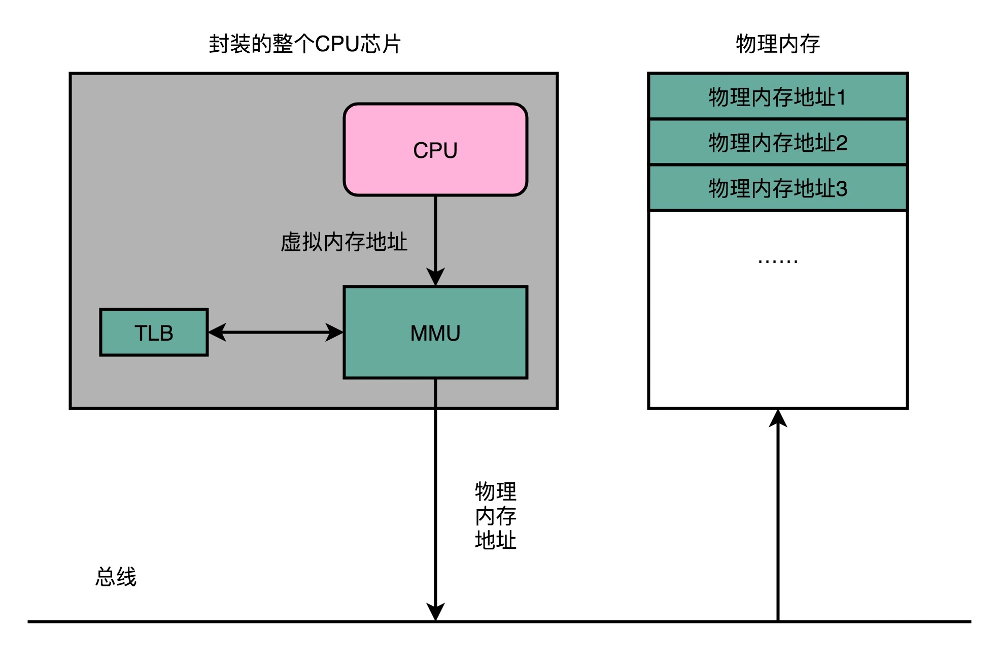

## 理解内存（下）：解析TLB和内存保护

性能问题：我们每一个指令都存放在内存里面，每一条数据都存放在内存里面。因此，“地址转换”是一个非常高频的动作，“地址转换”的性能就变得至关重要了。

内存安全问题：如果被人修改了内存里面的内容，我们的 CPU 就可能会去执行我们计划之外的指令。这个指令可能是破坏我们服务器里面的数据，也可能是被人获取到服务器里面的敏感信息。

### 地址变换高速缓冲（Translation-Lookaside Buffer）

TLB 和我们前面讲的 CPU 的高速缓存类似，可以分成指令的 TLB 和数据的 TLB，也就是 ITLB 和 DTLB。

为了性能，我们整个内存转换过程也要由硬件来执行。在 CPU 芯片里面，我们封装了内存管理单元（MMU，Memory Management Unit）芯片，用来完成地址转换。和 TLB 的访问和交互，都是由这个 MMU 控制的。

### 安全性与内存保护

就像我们在软件开发过程中，常常会有一个“兜底”的错误处理方案一样，在对于内存的管理里面，计算机也有一些最底层的安全保护机制。这些机制统称为内存保护（Memory Protection）。我这里就为你简单介绍两个。

- 可执行空间保护

这个机制是说，我们对于一个进程使用的内存，只把其中的指令部分设置成“可执行”的，对于其他部分，比如数据部分，不给予“可执行”的权限。因为无论是指令，还是数据，在我们的 CPU 看来，都是二进制的数据。我们直接把数据部分拿给 CPU，如果这些数据解码后，也能变成一条合理的指令，其实就是可执行的。

- 地址空间布局随机化

原先我们一个进程的内存布局空间是固定的，所以任何第三方很容易就能知道指令在哪里，程序栈在哪里，数据在哪里，堆又在哪里。这个其实为想要搞破坏的人创造了很大的便利。而地址空间布局随机化这个机制，就是让这些区域的位置不再固定，在内存空间随机去分配这些进程里不同部分所在的内存空间地址，让破坏者猜不出来。

### 
### 
### 
### 
### 思考题
### question