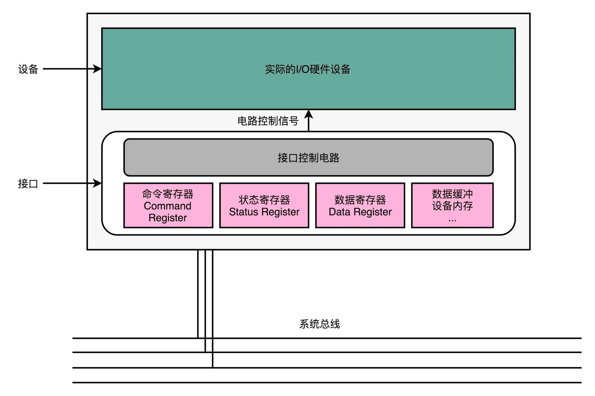
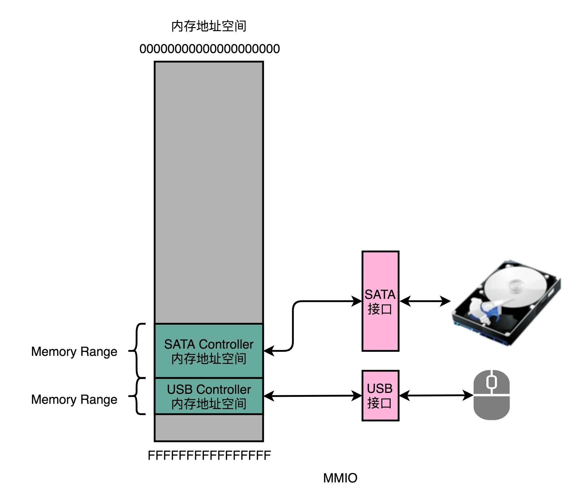
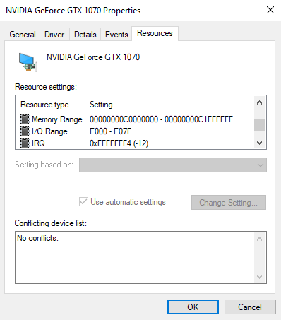

## 输入输出设备：我们并不是只能用灯泡显示“0”和“1”

### 接口和设备：经典的适配器模式

大部分的输入输出设备，都有两个组成部分。第一个是它的**接口（Interface）**，第二个才是**实际的 I/O 设备（Actual I/O Device）**。我们的硬件设备并不是直接接入到总线上和 CPU 通信的，而是通过接口，用接口连接到总线上，再通过总线和 CPU 通信。

接口本身就是一块电路板。CPU 其实不是和实际的硬件设备打交道，而是和这个接口电路板打交道。我们平时说的，设备里面有三类寄存器，其实都在这个设备的接口电路上，而不在实际的设备上。

那这三类寄存器是哪三类寄存器呢？它们分别是状态寄存器（Status Register）、 命令寄存器（Command Register）以及数据寄存器（Data Register）

### 面向接口编程

当我们要对计算机升级，我们不会扔掉旧的计算机，直接买一台全新的计算机，而是可以单独升级硬盘这样的设备。我们把老硬盘从接口上拿下来，换一个新的上去就好了。各种输入输出设备的制造商，也可以根据接口的控制协议，来设计和制造硬盘、鼠标、键盘、打印机乃至其他种种外设。正是这样的分工协作，带来了 PC 时代的繁荣。

其实，在软件的设计模式里也有这样的思路。面向对象里的面向接口编程的接口，就是 Interface。如果你做 iOS 的开发，Objective-C 里面的 Protocol 其实也是这个意思。而 Adaptor 设计模式，更是一个常见的、用来解决不同外部应用和系统“适配”问题的方案。可以看到，计算机的软件和硬件，在逻辑抽象上，其实是相通的。

### CPU 是如何控制 I/O 设备的？

无论是内置在主板上的接口，还是集成在设备上的接口，除了三类寄存器之外，还有对应的控制电路。正是通过这个控制电路，CPU 才能通过向这个接口电路板传输信号，来控制实际的硬件。

首先是数据寄存器（Data Register）。CPU 向 I/O 设备写入需要传输的数据，比如要打印的内容是“GeekTime”，我们就要先发送一个“G”给到对应的 I/O 设备。

然后是命令寄存器（Command Register）。CPU 发送一个命令，告诉打印机，要进行打印工作。这个时候，打印机里面的控制电路会做两个动作。第一个，是去设置我们的状态寄存器里面的状态，把状态设置成 not-ready。第二个，就是实际操作打印机进行打印。

而状态寄存器（Status Register），就是告诉了我们的 CPU，现在设备已经在工作了，所以这个时候，CPU 你再发送数据或者命令过来，都是没有用的。直到前面的动作已经完成，状态寄存器重新变成了 ready 状态，我们的 CPU 才能发送下一个字符和命令。

### 信号和地址：发挥总线的价值

搞清楚了实际的 I/O 设备和接口之间的关系，一个新的问题就来了。那就是，我们的 CPU 到底要往总线上发送一个什么样的命令，才能和 I/O 接口上的设备通信呢？

CPU 和 I/O 设备的通信，一样是通过 CPU 支持的机器指令来执行的。如果你回头去看一看第 5 讲，MIPS 的机器指令的分类，你会发现，我们并没有一种专门的和 I/O 设备通信的指令类型。那么，MIPS 的 CPU 到底是通过什么样的指令来和 I/O 设备来通信呢？

答案就是，和访问我们的主内存一样，使用“内存地址”。为了让已经足够复杂的 CPU 尽可能简单，计算机会把 I/O 设备的各个寄存器，以及 I/O 设备内部的内存地址，都映射到主内存地址空间里来。主内存的地址空间里，会给不同的 I/O 设备预留一段一段的内存地址。CPU 想要和这些 I/O 设备通信的时候呢，就往这些地址发送数据。这些地址信息，就是通过上一讲的地址线来发送的，而对应的数据信息呢，自然就是通过数据线来发送的了。

而我们的 I/O 设备呢，就会监控地址线，并且在 CPU 往自己地址发送数据的时候，把对应的数据线里面传输过来的数据，接入到对应的设备里面的寄存器和内存里面来。CPU 无论是向 I/O 设备发送命令、查询状态还是传输数据，都可以通过这样的方式。这种方式呢，叫作内存映射IO（Memory-Mapped I/O，简称 MMIO）。

Intel CPU 虽然也支持 MMIO，不过它还可以通过特定的指令，来支持端口映射 I/O（Port-Mapped I/O，简称 PMIO）或者也可以叫独立输入输出（Isolated I/O）。

其实 PMIO 的通信方式和 MMIO 差不多，核心的区别在于，PMIO 里面访问的设备地址，不再是在内存地址空间里面，而是一个专门的端口（Port）。这个端口并不是指一个硬件上的插口，而是和 CPU 通信的一个抽象概念。

无论是 PMIO 还是 MMIO，CPU 都会传送一条二进制的数据，给到 I/O 设备的对应地址。设备自己本身的接口电路，再去解码这个数据。解码之后的数据呢，就会变成设备支持的一条指令，再去通过控制电路去操作实际的硬件设备。对于 CPU 来说，它并不需要关心设备本身能够支持哪些操作。它要做的，只是在总线上传输一条条数据就好了。

这个，其实也有点像我们在设计模式里面的 Command 模式。我们在总线上传输的，是一个个数据对象，然后各个接受这些对象的设备，再去根据对象内容，进行实际的解码和命令执行。

这是一张我自己的显卡，在设备管理器里面的资源（Resource）信息。你可以看到，里面既有 Memory Range，这个就是设备对应映射到的内存地址，也就是我们上面所说的 MMIO 的访问方式。同样的，里面还有 I/O Range，这个就是我们上面所说的 PMIO，也就是通过端口来访问 I/O 设备的地址。最后，里面还有一个 IRQ，也就是会来自于这个设备的中断信号了。

### 
### 
### 思考题
### question