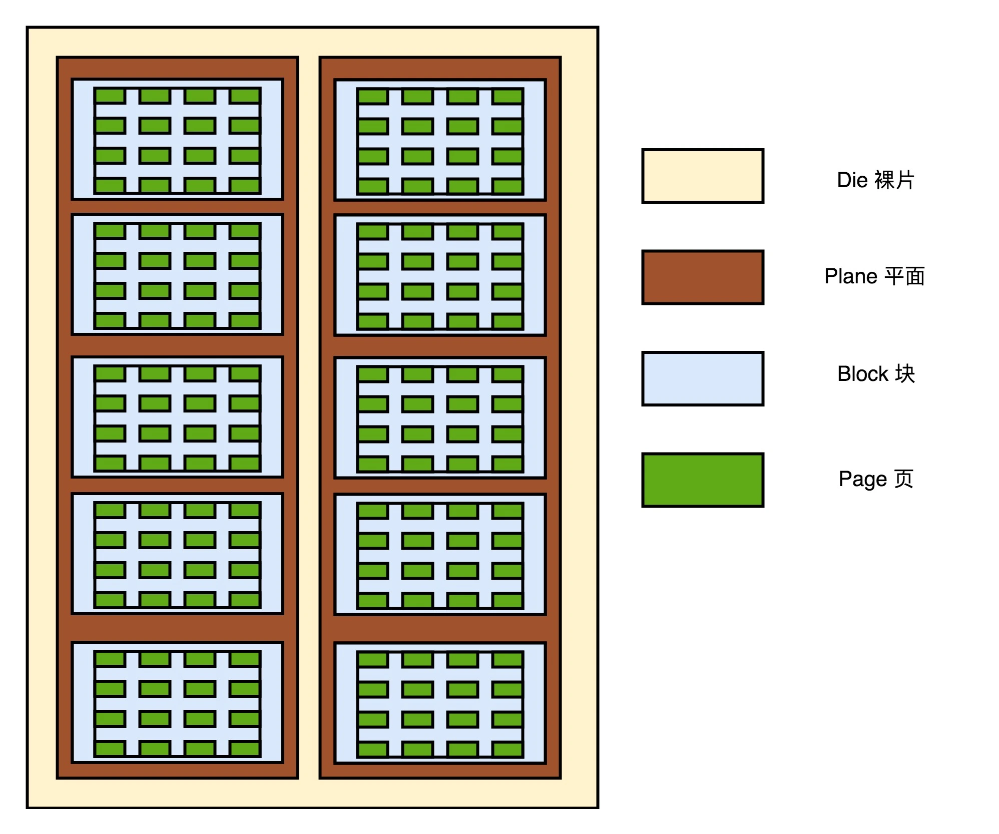

## SSD硬盘（上）：如何完成性能优化的KPI？

只是简单地换一下 SSD 硬盘，真的最大限度地用好了 SSD 硬盘吗？另外，即便现在 SSD 硬盘很便宜了，大部分公司的批量数据处理系统，仍然在用传统的机械硬盘，这又是为什么呢？

### SSD 的读写原理

要想知道为什么 SSD 的耐用性不太好，我们先要理解 SSD 硬盘的存储和读写原理。

### SLC、MLC、TLC 和 QLC

能够记录一个比特很容易理解。给电容里面充上电有电压的时候就是 1，给电容放电里面没有电就是 0。采用这样方式存储数据的 SSD 硬盘，我们一般称之为使用了 SLC（Single-Level Cell） 的颗粒，也就是一个存储单元中只有一位数据。

但是，这样的方式会遇到和 CPU Cache 类似的问题，那就是，同样的面积下，能够存放下的元器件是有限的。如果只用 SLC，我们就会遇到，存储容量上不去，并且价格下不来的问题。于是呢，硬件工程师们就陆续发明了 MLC（Multi-Level Cell）、TLC（Triple-Level Cell）以及 QLC（Quad-Level Cell），也就是能在一个电容里面存下 2 个、3 个乃至 4 个比特。

### P/E 擦写问题

首先，自然和其他的 I/O 设备一样，它有对应的接口和控制电路。现在的 SSD 硬盘用的是 SATA 或者 PCI Express 接口。在控制电路里，有一个很重要的模块，叫作 FTL（Flash-Translation Layer），也就是闪存转换层。

接下来是实际 I/O 设备，它其实和机械硬盘很像。现在新的大容量 SSD 硬盘都是 3D 封装的了，也就是说，是由很多个裸片（Die）叠在一起的

接下来，一张裸片上可以放多个平面（Plane），一般一个平面上的存储容量大概在 GB 级别。一个平面上面，会划分成很多个块（Block），一般一个块（Block）的存储大小， 通常几百 KB 到几 MB 大小。一个块里面，还会区分很多个页（Page），就和我们内存里面的页一样，一个页的大小通常是 4KB。

**对于 SSD 硬盘来说，数据的写入叫作 Program。写入不能像机械硬盘一样，通过覆写（Overwrite）来进行的，而是要先去擦除（Erase），然后再写入。**

SSD 的读取和写入的基本单位，不是一个比特（bit）或者一个字节（byte），而是一个页（Page）。SSD 的擦除单位就更夸张了，我们不仅不能按照比特或者字节来擦除，连按照页来擦除都不行，我们必须按照块来擦除。

而且，你必须记住的一点是，SSD 的使用寿命，其实是每一个块（Block）的擦除的次数。

### SSD 读写的生命周期

对于数据的擦除，只能整块进行。所以，我们需要用一个，类似“磁盘碎片整理”或者“内存垃圾回收”这样的机制，来清理块当中的数据空洞。而 SSD 硬盘也会保留一定的预留空间，避免出现硬盘无法写满的情况。

### 总结

SSD 硬盘，特别适合读多写少的应用。在日常应用里面，我们的系统盘适合用 SSD。

### 思考题
### question

1. SSD 读写的生命周期