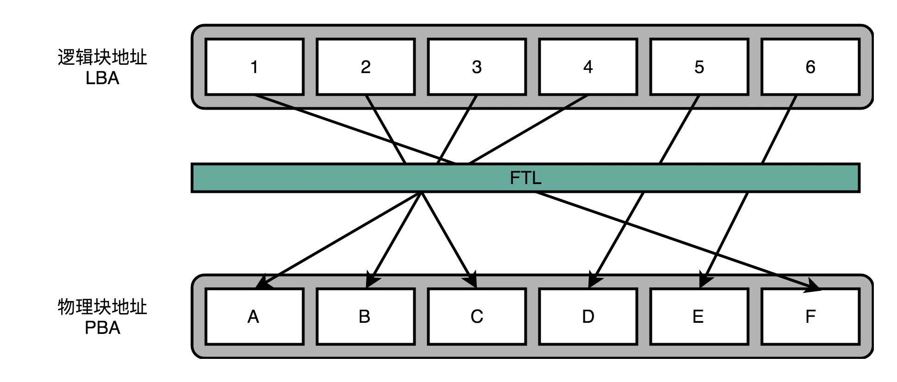

## SSD硬盘（下）：如何完成性能优化的KPI？

如果你平时用的是 Windows 电脑，你会发现，用了 SSD 的系统盘，就不能用磁盘碎片整理功能。这是因为，一旦主动去运行磁盘碎片整理功能，就会发生一次块的擦除，对应块的寿命就少了一点点。这个 SSD 的擦除寿命的问题，不仅会影响像磁盘碎片整理这样的功能，其实也很影响我们的日常使用。

### FTL 和磨损均衡

我们要的就是想一个办法，让 SSD 硬盘各个块的擦除次数，均匀分摊到各个块上。这个策略呢，就叫作磨损均衡（Wear-Leveling）。实现这个技术的核心办法，和我们前面讲过的虚拟内存一样，就是添加一个间接层。这个间接层，就是我们上一讲给你卖的那个关子，就是 FTL 这个闪存转换层。

就像在管理内存的时候，我们通过一个页表映射虚拟内存页和物理页一样，在 FTL 里面，存放了逻辑块地址（Logical Block Address，简称 LBA）到物理块地址（Physical Block Address，简称 PBA）的映射。

操作系统访问的硬盘地址，其实都是逻辑地址。只有通过 FTL 转换之后，才会变成实际的物理地址，找到对应的块进行访问。操作系统本身，不需要去考虑块的磨损程度，只要和操作机械硬盘一样来读写数据就好了。

这也是我们在设计大型系统中的一个典型思路，也就是各层之间是隔离的，操作系统不需要考虑底层的硬件是什么，完全交由硬件的控制电路里面的 FTL，来管理对于实际物理硬件的写入。

### TRIM 指令的支持

不过，操作系统不去关心实际底层的硬件是什么，在 SSD 硬盘的使用上，也会带来一个问题。这个问题就是，操作系统的逻辑层和 SSD 的逻辑层里的块状态，是不匹配的。

我们在操作系统里面去删除一个文件，其实并没有真的在物理层面去删除这个文件，只是在文件系统里面，把对应的 inode 里面的元信息清理掉，这代表这个 inode 还可以继续使用，可以写入新的数据。这个时候，实际物理层面的对应的存储空间，在操作系统里面被标记成可以写入了。

所以，其实我们日常的文件删除，都只是一个操作系统层面的逻辑删除。这也是为什么，很多时候我们不小心删除了对应的文件，我们可以通过各种恢复软件，把数据找回来。同样的，这也是为什么，如果我们想要删除干净数据，需要用各种“文件粉碎”的功能才行。

这个删除的逻辑在机械硬盘层面没有问题，因为文件被标记成可以写入，后续的写入可以直接覆写这个位置。但是，在 SSD 硬盘上就不一样了。

在使用 SSD 的硬盘情况下，你会发现，操作系统对于文件的删除，SSD 硬盘其实并不知道。这就导致，我们为了磨损均衡，很多时候在都在搬运很多已经删除了的数据。这就会产生很多不必要的数据读写和擦除，既消耗了 SSD 的性能，也缩短了 SSD 的使用寿命。

为了解决这个问题，现在的操作系统和 SSD 的主控芯片，都支持 TRIM 命令。这个命令可以在文件被删除的时候，让操作系统去通知 SSD 硬盘，对应的逻辑块已经标记成已删除了。

### 写入放大

当 SSD 硬盘的存储空间被占用得越来越多，每一次写入新数据，我们都可能没有足够的空白。我们可能不得不去进行垃圾回收，合并一些块里面的页，然后再擦除掉一些页，才能匀出一些空间来。

这个时候，从应用层或者操作系统层面来看，我们可能只是写入了一个 4KB 或者 4MB 的数据。但是，实际通过 FTL 之后，我们可能要去搬运 8MB、16MB 甚至更多的数据。

而解决写入放大，需要我们在后台定时进行垃圾回收，在硬盘比较空闲的时候，就把搬运数据、擦除数据、留出空白的块的工作做完，而不是等实际数据写入的时候，再进行这样的操作。

### AeroSpike：如何最大化 SSD 的使用效率？

AeroSpike 这个专门针对 SSD 硬盘特性设计的 Key-Value 数据库（键值对数据库），是怎么利用这些物理特性的。

1. 跳过文件系统直写硬盘
2. 写大块读小块
3. 用高水位算法持续进行磁盘碎片整理
4. 只使用 SSD 硬盘的一半空间。

### 思考题
### question

1. AeroSpike：如何最大化 SSD 的使用效率？