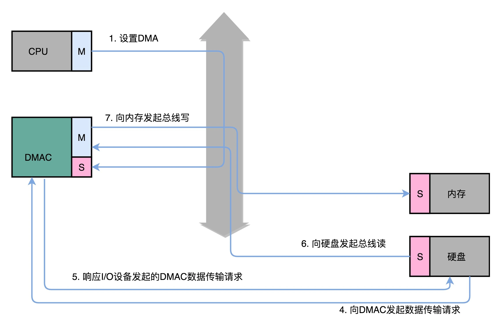
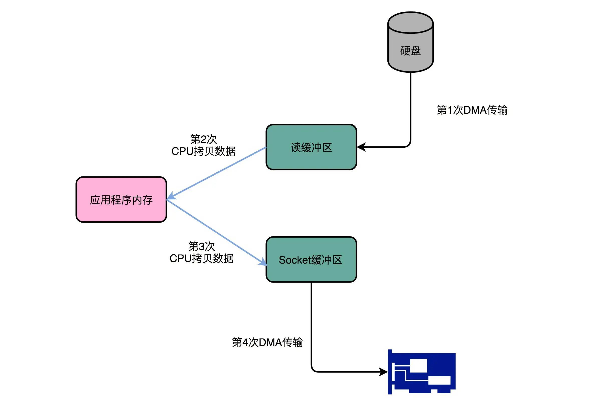
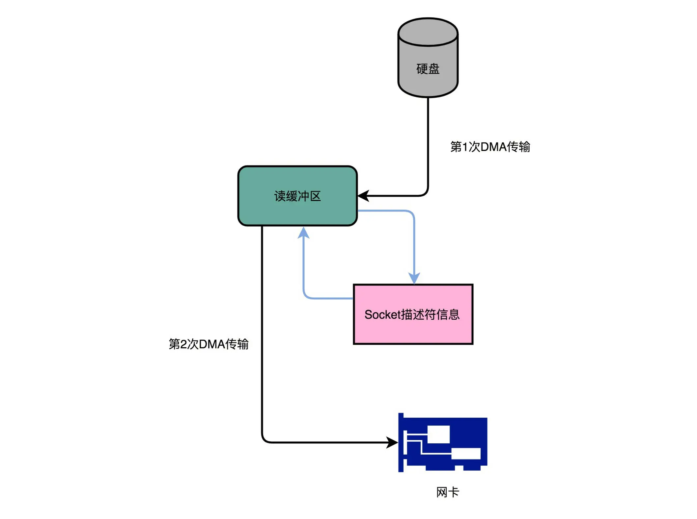

## DMA：为什么Kafka这么快？

们对于 I/O 的操作，都是由 CPU 发出对应的指令，然后等待 I/O 设备完成操作之后返回，那 CPU 有大量的时间其实都是在等待 I/O 设备完成操作。

但是，这个 CPU 的等待，在很多时候，其实并没有太多的实际意义。我们对于 I/O 设备的大量操作，其实都只是把内存里面的数据，传输到 I/O 设备而已。在这种情况下，其实 CPU 只是在傻等而已。特别是当传输的数据量比较大的时候，比如进行大文件复制，如果所有数据都要经过 CPU，实在是有点儿太浪费时间了。

因此，发明了 DMA 技术，也就是直接内存访问（Direct Memory Access）技术，来减少 CPU 等待的时间。

### 理解 DMA，一个协处理器

本质上，DMA 技术就是我们在主板上放一块独立的芯片。在进行内存和 I/O 设备的数据传输的时候，我们不再通过 CPU 来控制数据传输，而直接通过 DMA 控制器（DMA Controller，简称 DMAC）。这块芯片，我们可以认为它其实就是一个协处理器（Co-Processor）。

**DMAC 最有价值的地方体现在，当我们要传输的数据特别大、速度特别快，或者传输的数据特别小、速度特别慢的时候。**

DMAC 其实也是一个特殊的 I/O 设备，它和 CPU 以及其他 I/O 设备一样，通过连接到总线来进行实际的数据传输。总线上的设备呢，其实有两种类型。一种我们称之为主设备（Master），另外一种，我们称之为从设备（Slave）。

### IO过程

想要主动发起数据传输，必须要是一个主设备才可以，CPU 就是主设备。而我们从设备（比如硬盘）只能接受数据传输。所以，如果通过 CPU 来传输数据，要么是 CPU 从 I/O 设备读数据，要么是 CPU 向 I/O 设备写数据。

这个时候你可能要问了，那我们的 I/O 设备不能向主设备发起请求么？可以是可以，不过这个发送的不是数据内容，而是控制信号。I/O 设备可以告诉 CPU，我这里有数据要传输给你，但是实际数据是 CPU 拉走的，而不是 I/O 设备推给 CPU 的。



不过，DMAC 就很有意思了，它既是一个主设备，又是一个从设备。对于 CPU 来说，它是一个从设备；对于硬盘这样的 IO 设备来说呢，它又变成了一个主设备。那使用 DMAC 进行数据传输的过程究竟是什么样的呢？

1. 首先，CPU 还是作为一个主设备，向 DMAC 设备发起请求。这个请求，其实就是在 DMAC 里面修改配置寄存器。
2. CPU 修改 DMAC 的配置的时候，会告诉 DMAC 这样几个信息：首先是源地址的初始值以及传输时候的地址增减方式；其次是目标地址初始值和传输时候的地址增减方式；第三个自然是要传输的数据长度
3. 设置完这些信息之后，DMAC 就会变成一个空闲的状态（Idle）。
4. 如果我们要从硬盘上往内存里面加载数据，这个时候，硬盘就会向 DMAC 发起一个数据传输请求。这个请求并不是通过总线，而是通过一个额外的连线。
5. 然后，我们的 DMAC 需要再通过一个额外的连线响应这个申请。
6. 于是，DMAC 这个芯片，就向硬盘的接口发起要总线读的传输请求。数据就从硬盘里面，读到了 DMAC 的控制器里面。
7. 然后，DMAC 再向我们的内存发起总线写的数据传输请求，把数据写入到内存里面。
8.DMAC 会反复进行上面第 6、7 步的操作，直到 DMAC 的寄存器里面设置的数据长度传输完成。
9. 数据传输完成之后，DMAC 重新回到第 3 步的空闲状态。

所以，整个数据传输的过程中，我们不是通过 CPU 来搬运数据，而是由 DMAC 这个芯片来搬运数据。但是 CPU 在这个过程中也是必不可少的。因为传输什么数据，从哪里传输到哪里，其实还是由 CPU 来设置的。这也是为什么，DMAC 被叫作“协处理器”。


### Kafka 的实现原理

Kafka 是一个用来处理实时数据的管道，我们常常用它来做一个消息队列，或者用来收集和落地海量的日志。作为一个处理实时数据和日志的管道，瓶颈自然也在 I/O 层面。

Kafka 里面会有两种常见的海量数据传输的情况。一种是从网络中接收上游的数据，然后需要落地到本地的磁盘上，确保数据不丢失。另一种情况呢，则是从本地磁盘上读取出来，通过网络发送出去。

我们来看一看后一种情况，从磁盘读数据发送到网络上去。如果我们自己写一个简单的程序，最直观的办法，自然是用一个文件读操作，从磁盘上把数据读到内存里面来，然后再用一个 Socket，把这些数据发送到网络上去。

```sh

File.read(fileDesc, buf, len);
Socket.send(socket, buf, len);
```

在这个过程中，数据一共发生了四次传输的过程。其中两次是 DMA 的传输，另外两次，则是通过 CPU 控制的传输。下面我们来具体看看这个过程： 

第一次传输，是从硬盘上，读到操作系统内核的缓冲区里。这个传输是通过 DMA 搬运的。

第二次传输，需要从内核缓冲区里面的数据，复制到我们应用分配的内存里面。这个传输是通过 CPU 搬运的。

第三次传输，要从我们应用的内存里面，再写到操作系统的 Socket 的缓冲区里面去。这个传输，还是由 CPU 搬运的。

最后一次传输，需要再从 Socket 的缓冲区里面，写到网卡的缓冲区里面去。这个传输又是通过 DMA 搬运的。



这个时候，你可以回过头看看这个过程。我们只是要“搬运”一份数据，结果却整整搬运了四次。而且这里面，从内核的读缓冲区传输到应用的内存里，再从应用的内存里传输到 Socket 的缓冲区里，其实都是把同一份数据在内存里面搬运来搬运去，特别没有效率。

事实上，Kafka 做的事情就是，把这个数据搬运的次数，从上面的四次，变成了两次，并且只有 DMA 来进行数据搬运，而不需要 CPU。

Kafka 的代码调用了 Java NIO 库，具体是 FileChannel 里面的 transferTo 方法。我们的数据并没有读到中间的应用内存里面，而是直接通过 Channel，写入到对应的网络设备里。并且，对于 Socket 的操作，也不是写入到 Socket 的 Buffer 里面，而是直接根据描述符（Descriptor）写入到网卡的缓冲区里面。于是，在这个过程之中，我们只进行了两次数据传输。



第一次，是通过 DMA，从硬盘直接读到操作系统内核的读缓冲区里面。第二次，则是根据 Socket 的描述符信息，直接从读缓冲区里面，写入到网卡的缓冲区里面。

这样，我们同一份数据传输的次数从四次变成了两次，并且没有通过 CPU 来进行数据搬运，所有的数据都是通过 DMA 来进行传输的。

在这个方法里面，我们没有在内存层面去“复制（Copy）”数据，所以这个方法，也被称之为零拷贝（Zero-Copy）。


### 
### 
### 
### 
### 思考题
### question